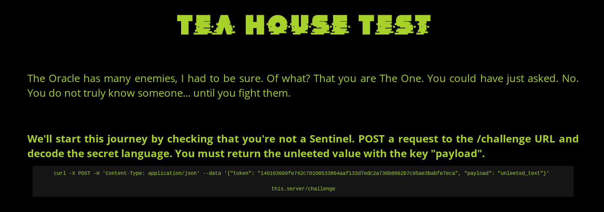

# 							D.N.A. - 20 pts

>  Rediscover your hacker's roots interiutwzsx3dvp.onion

Ce site est une adresse du réseau Tor. J'installe donc [Tor Browser](https://www.torproject.org/download/). Voici à quoi ressemble la page :



À chaque rafraîchissment de la page, un nouveau token est donné. Tor Browser étant un navigateur Firefox, je commence par installer [RESTClient](https://addons.mozilla.org/fr/firefox/addon/restclient/), une extension permettant de créer des requêtes facilement. Je poste le JSON fourni et je reçoit cette réponse :

```json
{"quote":"4 c3n5u5 74k3r 0nc3 7ri3d 70 7357 m3. i 473 hi5 1iv3r wi7h 50m3 f4v4 b34n5 4nd 4 nic3 chi4n7i."}
```

 C'est du [leet](https://fr.wikipedia.org/wiki/Leet_speak) (on comprend mieux le *unleeted* dans le texte de la page). Après plusieurs essais, on se rend compte que les transformation sont assez simples : les lettres `o`, `l`, `e`, `a`, `s`, `t` sont toujours remplacées par `0`, `1`, `3`, `4`, `5` et `7`.

Je pourrais faire un programme dans la console JavaScript de Tor Browser mais ce n'est pas mon langage de prédilection et j'ai peur d'être limité par les restrictions de sécurité de ce navigateur. Je me dis que c'est donc l'occasion parfaite pour apprendre à utiliser un proxy [Socks5](https://fr.wikipedia.org/wiki/SOCKS), dont j'avais déjà entendu parler.

Je fais des recherches et j'apprends que Tor Browser fournit naturellement un proxy socks5 sur le port 9150 !  Je tombe rapidement sur [cet exemple](https://gist.github.com/jefftriplett/9748036) :

```python
import requests

proxies = {
    'http': 'socks5://127.0.0.1:9150',
    'https': 'socks5://127.0.0.1:9150'
}

url = 'http://ifconfig.me/ip'

response = requests.get(url)
print('ip: {}'.format(response.text.strip()))

response = requests.get(url, proxies=proxies)
print('tor ip: {}'.format(response.text.strip()))
```

Cela fonctionne, j'arrive à accéder à des sites via Tor. Seulement cela ne fonctionne plus avec des site en `.onion`. [StackOverflow](https://stackoverflow.com/questions/51259693/python-requests-lib-working-via-proxysocks5-tor-error) me sauve la mise : il faut remplacer `socks5://` par `socks5h://` dans les adresses proxy.

Voici le programme final :

```python
import requests

conv = {"0": "o", "1":"l", "3":"e", "4":"a", "5":"s", "7":"t"}

s = requests.session()
s.proxies['http'] = 'socks5h://127.0.0.1:9150'
s.proxies['https'] = 'socks5h://127.0.0.1:9150'

source = s.get("http://interiutwzsx3dvp.onion/").content.decode()
token = source.split("\n")[23].split('"')[3]

r = s.post('http://interiutwzsx3dvp.onion//challenge', json={"token": token}).json()

while 'quote' in r:
    quote = r['quote']
    print('\nchallenge :', quote)
    
    for k in conv:
        quote = quote.replace(k, conv[k])
        
    print('answer:', quote)

    r = s.post('http://interiutwzsx3dvp.onion//challenge', json={"token": token, "payload": quote}).json()


print("\n", r)

```

Cela tourne une petite minute avant d'afficher :

```json
 {'congratz': 'First step completed, gg wp', 'flag': 'H2G2{th3r3_1s_n0_SP00N}'}
```

Merci Masterfox pour ce misc super original !