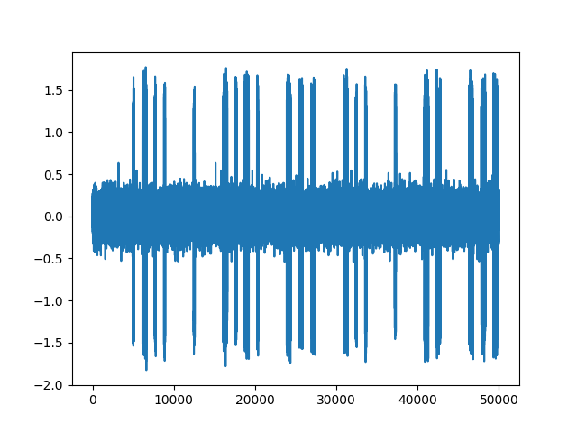
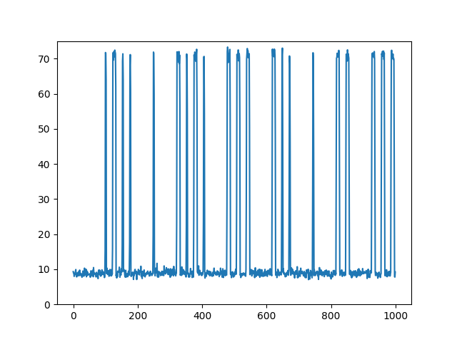

# B.A. BA - 30 pts

> Votre ami Walrus s'initie à la radio et a découvert une nouvelle façon de communiquer. Il vous a donné un signal échantillonné à 200kHz que vous devez décoder. `challenge.iq` (9.5MB) : https://files.france-cybersecurity-challenge.fr/dl/ba_ba/challenge.iq.7z SHA256(`challenge.iq`) = `382ecbce7f9bd1e38ea99f626d3f56a8140ddf3210e12db597eabbd081656fde`. Le flag est au format `FCSC{<flag en lower case>}`.

Pour commencer, ouvrons le fichier avec [Gqrx](https://github.com/csete/gqrx) pour voir la tête du signal et essayer de le décoder. À l'oreille cela ressemble à du morse. Le signal est vraiment long, on ne va quand même pas le décoder à la main !

 Ouvrons le signal avec Python :

```python
import numpy
import matplotlib.pyplot as plt

signal = numpy.fromfile("challenge.iq", dtype = numpy.complex64)

plt.plot(signal)
plt.show()
```

En zoomant, on distingue les pics correspondant aux bips au dessus du bruit :



Afin de traiter cela plus facilement, je vais traiter le signal par bloc de 50 échantillons dont je vais faire la somme. Voilà ce que ça donne pour ce même début de signal :

```python
import numpy
import matplotlib.pyplot as plt

signal = numpy.fromfile("challenge.iq", dtype = numpy.complex64)
sommes = []

for i in range(0, len(signal), 50):
    sommes.append(sum(numpy.abs(signal[i:i+50])))

plt.plot(sommes[:50000//50])
plt.show()
```



On distingue très nettement le signal du bruit. Il ne reste plus qu'à compter la durée des pics et la durée des distances :

```python
import numpy
import matplotlib.pyplot as plt

signal = numpy.fromfile("challenge.iq", dtype = numpy.complex64)

longueur, distance = 0, 0

for i in range(0, len(signal), 50):
    somme = sum(numpy.abs(signal[i:i+50]))

    if somme > 40: # ça bippe
        longueur += 1
        if distance > 0: # c'est le début d'un nouveau pic
            print("pause de", distance)
            distance = 0
        
    else: # ça bippe pas
        distance += 1
        if longueur > 0: # c'est la fin d'un pic
            print("pic de", longueur)
            longueur = 0
```

Ce qui donne :

```
pause de 100
pic de 3
pause de 20
pic de 10
pause de 20
pic de 3
pause de 20
pic de 3
pause de 70
pic de 3
pause de 70
pic de 10
pause de 20
pic de 3
pause de 20
pic de 10
[...]
```

Maintenant que l'on connaît la durée des pics correspondant à un `.` ou un `-` morse et la durée de l'intervalle entre 2 symboles, c'est très simple :

```python
import numpy
import matplotlib.pyplot as plt

signal = numpy.fromfile("challenge.iq", dtype = numpy.complex64)

longueur, distance = 0, 0

for i in range(0, len(signal), 50):
    somme = sum(numpy.abs(signal[i:i+50]))

    if somme > 40 :
        longueur += 1
        if distance > 0:
            if distance > 50:
                print(" ", end="")
            distance = 0
        
    else:
        distance += 1
        if longueur > 0:
            if longueur > 6:
                print("-", end="")
            else:
                print(".", end="")
            longueur = 0
```

Ce qui donne :

```
 .-.. . -.-. --- -.. . -- --- .-. ... . .. -. - . .-. -. .- - .. --- -. .- .-.. --- ..- .-.. .- .-.. .--. .... .- -... . - -- --- .-. ... . .. -. - . .-. -. .- - .. --- -. .- .-.. . ... - ..- -. -.-. --- -.. . .--. . .-. -- . - - .- -. - -.. . - .-. .- -. ... -- . - - .-. . ..- -. - . -..- - . .- .-.. .- .. -.. . -.. . ... . .-. .. . ... -.. .. -- .--. ..- .-.. ... .. --- -. ... -.-. --- ..- .-. - . ... . - .-.. --- -. --. ..- . ... --.- ..- . .-.. .-.. . ... ... --- .. . -. - .--. .-. --- -.. ..- .. - . ... .--. .- .-. -.. . ... ... .. --. -. . ... ..- -. . .-.. ..- -- .. . .-. . ..- -. ... --- -. --- ..- ..- -. --. . ... - . ... - --- .--. -.-. . -.-. --- -.. . . ... - ... --- ..- ...- . -. - .- - - .-. .. -... ..- . .- ... .- -- ..- . .-.. -- --- .-. ... . -.-. . .--. . -. -.. .- -. - .--. .-.. ..- ... .. . ..- .-. ... -.-. --- -. - . ... - . -. - -.-. . - - . .--. .-. .. -- .- ..- - . . - - . -. -.. . -. - .- .- - - .-. .. -... ..- . .-. .-.. .- .--. .- - . .-. -. .. - . -.. ..- .-.. .- -. --. .- --. . .- ... --- -. .- ... ... .. ... - .- -. - .- .-.. ..-. .-. . -.. ...- .- .. .-.. ... - --- .--. .-.. . ..-. .-.. .- --. . ... - . -.... ---.. ----. .---- -.-. ---.. -... -... ---.. -.-. -.-. ..-. . ----. ..... .- --... -.... --... ....- ..... --... ..-. ...-- .- .---- -... --... ...-- ---.. -.... .---- ----. ..--- ---.. .- ----- ----- ..--- -.-. ..... ----- ----. ....- --... -.... ..--- -.. ..... ---.. ----- -.-. -.. --... -... -.-. ....- .- .---- ..... -.-. -.... ....- ... - --- .--. .. -. ...- . -. - . . -. .---- ---.. ...-- ..--- .--. --- ..- .-. .-.. .- - . .-.. . --. .-. .- .--. .... .. . -.-. . -.-. --- -.. .- --. . -.. . -.-. .- .-. .- -.-. - . .-. . ... .- ... ... .. --. -. . .- -.-. .... .- --.- ..- . .-.. . - - .-. . -.-. .... .. ..-. ..-. .-. . . - ... .. --. -. . -.. . .--. --- -. -.-. - ..- .- - .. --- -. ..- -. . -.-. --- -- -... .. -. .- .. ... --- -. ..- -. .. --.- ..- . -.. . ... .. --. -. .- ..- -..- .. -. - . .-. -- .. - - . -. - ... ... - --- .--. .-.. . -.-. --- -.. . -- --- .-. ... . . ... - -.-. --- -. ... .. -.. . .-. . -.-. --- -- -- . .-.. . .--. .-. . -.-. ..- .-. ... . ..- .-. -.. . ... -.-. --- -- -- ..- -. .. -.-. .- - .. --- -. ... -. ..- -- . .-. .. --.- ..- . ... ... - --- .--.
```

On passe ça sur un [décodeur de morse](https://www.dcode.fr/code-morse) et on obtient :

```
LECODEMORSEINTERNATIONALOULALPHABETMORSEINTERNATIONALESTUNCODEPERMETTANTDETRANSMETTREUNTEXTEALAIDEDESERIESDIMPULSIONSCOURTESETLONGUESQUELLESSOIENTPRODUITESPARDESSIGNESUNELUMIEREUNSONOUUNGESTESTOPCECODEESTSOUVENTATTRIBUEASAMUELMORSECEPENDANTPLUSIEURSCONTESTENTCETTEPRIMAUTEETTENDENTAATTRIBUERLAPATERNITEDULANGAGEASONASSISTANTALFREDVAILSTOPLEFLAGESTE6891C8BB8CCFE95A767457F3A1B73861928A002C5094762D580CD7BC4A15C64STOPINVENTEEN1832POURLATELEGRAPHIECECODAGEDECARACTERESASSIGNEACHAQUELETTRECHIFFREETSIGNEDEPONCTUATIONUNECOMBINAISONUNIQUEDESIGNAUXINTERMITTENTSSTOPLECODEMORSEESTCONSIDERECOMMELEPRECURSEURDESCOMMUNICATIONSNUMERIQUESSTOP
```

On distingue `LE FLAG EST E6891C8BB8CCFE95A767457F3A1B73861928A002C5094762D580CD7BC4A15C64 STOP` donc on valide avec `FCSC{e6891c8bb8ccfe95a767457f3a1b73861928a002c5094762d580cd7bc4a15c64}`.

