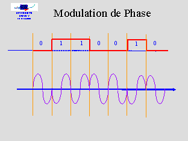

# Phase à phase - 50 pts

>  Au cours de votre voyage à Manchester, vous avez capturé un signal, échantillonné à 2 millions d'échantillons par seconde. 
>
>  Décodez-le !
>
>   SHA256(`challenge.iq`) = `640ec3956cf9f89c398ffa39d1eb55d68cc685989ca8fed249f0d44ed636c88a`.
>
>  [challenge.iq](challenge.iq)

Ouvrons le signal avec Python et regardons sa phase :

```python
import numpy as np
import matplotlib.pyplot as plt

signal = np.fromfile("challenge.iq", dtype=np.complex64)
phase = np.angle(signal)

plt.subplot(211)
plt.plot(signal[:200])

plt.subplot(212)
plt.plot(phase[:200], 'bx')

plt.show()
```


Le signal est une sinusoïde avec des "demi-tours" qui se matérialisent par une non continuité de la phase (pour rappel, la phase est un angle entre -π et π donc le passage brusque de la courbe de phase du haut de la fenêtre au bas est normal, ce sont les autres *cassures* qui sont intéressantes). Affichons la différence entre 2 phases consécutives :

```python
import numpy as np
import matplotlib.pyplot as plt

signal = np.fromfile("challenge.iq", dtype=np.complex64)
phase = np.angle(signal)

for i in range(1, 50):
    print(i, ":", (phase[i]-phase[i-1])%(2*np.pi))
```

```
1 : 0.2751886248588562
2 : 0.3443361520767212
3 : 0.28958117961883545
4 : 0.4020735025405884
5 : 0.25920891761779785
6 : 0.31798863410949707
7 : 0.2906322479248047
8 : 0.33422547975649053
9 : 0.3474557399749756
10 : 0.25159263610839844
11 : 0.33324670791625977
12 : 0.34558165073394775
13 : 3.5062479972839355
14 : 0.2592134475708008
15 : 0.3129537105560303
16 : 0.2874794006347656
17 : 0.32009315490722656
18 : 0.3174846808062952
19 : 0.3200798034667969
20 : 0.3534584045410156
21 : 0.26102590560913086
22 : 0.2928861379623413
23 : 0.3657606840133667
24 : 0.3048272132873535
25 : 0.26115936040878296
26 : 0.33545610308647156
27 : 0.34242385625839233
28 : 0.3025243282318115
29 : 3.475715462361471
30 : 0.2966275215148926
31 : 0.2912411689758301
32 : 0.3135414123535156
33 : 0.32162725925445557
34 : 0.3569523096084595
35 : 0.31317663192749023
36 : 0.2801305055618286
37 : 0.3350743353366852
38 : 0.3418848514556885
39 : 0.2819807529449463
40 : 0.34302493929862976
41 : 0.2862786054611206
42 : 0.3240436315536499
43 : 0.32313692569732666
44 : 0.30214083194732666
45 : 3.44914156595339
46 : 0.3041040003299713
47 : 0.31816646456718445
48 : 0.372528612613678
49 : 0.2410251349210739
```

Chaque échantillon a donc un décalage de phase d'environ 0.3 radians par rapport à son prédécesseur sauf le 13, le 29 et le 45 qui ont un décalage de 3.5 rad (0.3+π). On peut continuer ainsi et l'on remarquera que les *cassures* ont lieu exactement tous les `13+16k` échantillons.

Pour rappel voici comment fonctionne la modulation de phase :



La sinusoïde *fait demi-tour* (déphasage de π radians) dès que le bit d'information à envoyer change de valeur.

Appliquons cela à notre signal en regardant les déphasages tous les `13+16k` échantillons :

```python
import numpy as np

signal = np.fromfile("challenge.iq", dtype=np.complex64)
phase = np.angle(signal)

bit = 0
bits = ""

for i in range(13, len(signal), 16):
    if abs(phase[i]-phase[i-1]) > 1:
        bit = 1 - bit
    bits += str(bit)

print(bits)
```

Ce qui donne :

```
101010101010101010101010101010101010101010101010101010101010101010101010101010101010101010101010101010101010101010101010101010110011010100101101001101010100101100110011010010110011010101001011001010101100101101001010110100110010110101010011001011010100110101001011010010110010110101001011010010110010110100101101010011010010110101001011001011010011010100101101010011010100101011010011001011010101001101001011001100110100101101010101010010110101010101001011010011010010110101001011010010101101001100101101001011010010110100110011001011010100101101001011010100110100101100110011010010110011001100101101001011010010110100101101010010110011001100101101001101010100101011010011001011010010110100101101001101010100101101001101010010101101001101001010110100110100101101001101010010110010101100101101010011010010110100110101001011010100101101001011001101010100101100110011010010101101010101001011001100110100101101010011010010110101001100101101010010110010110100110011001011010011001101001011010101010010110100101101001011010010110100101101010011010010110101001011001011010011010101001011001010110010110100110011010010110101010100101101010100110100101011010101010010101101001101001011001100110010110100110101010010110100101101001010110101010010101010110010101010101010101
```

Bingo ! Il est très probable que nous ayons les bonnes données car l'énoncé laissait très subtilement imaginer qu'un [codage de Manchester](https://fr.wikipedia.org/wiki/Codage_Manchester) était utilisé : après chaque bit de donnée on envoie le bit contraire pour avoir un signal qui varie beaucoup (c'est plus facile à transmettre).

Voici le code final :

```python
import numpy as np

signal = np.fromfile("challenge.iq", dtype=np.complex64)
phase = np.angle(signal)

bit = 0
bits = ""

for i in range(13, len(signal), 16):
    if abs(phase[i]-phase[i-1]) > 1:
        bit = 1 - bit
    bits += str(bit)

bits = bits[::2] # on en prend un sur deux
bits = bits.lstrip("1")[1:] # on enlève tous les '1' au début puis le premier '0'

for i in range(0, len(bits), 8):
    print(chr(int(bits[i:i+7], 2)), end="")
```

 ```
 FCSC{9ab3c6bcdb9a5002c9fec155ff5d9fd29927bdc458511cee0ffbcd7e0a895d38}
 ```


### Compléments

Si vous voulez une résolution beaucoup plus académique (en utilisant GNURadio), allez jeter un œil ici : https://github.com/dspiricate/writeups/blob/main/FCSC/2021/hardware/Phase%20%C3%A0%20phase/README.md.