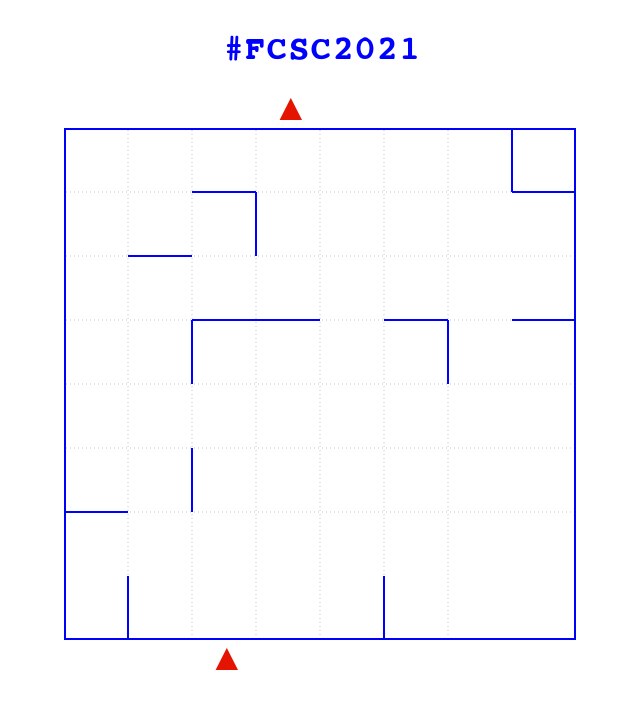
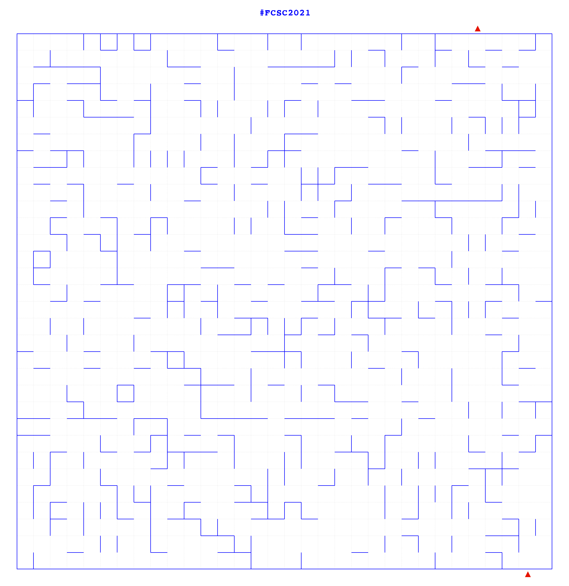

# Ventriglisse - 148 pts

> Session de ventriglisse !
>
> `nc challenges1.france-cybersecurity-challenge.fr 7002`

Quand on se connecte en utilisant netcat comme demandé, on reçoit les instructions suivantes :

```
Hey there!
Welcome to our new attraction: the famous Ventriglisse!
A square area is filed with soap and some water and is very slippery!
Here is an example (base64-encoded image):
------------------------ BEGIN MAZE ------------------------
iVBORw0KGgoAAAANSUhEUgAAAoAAAALACAIAAACM91QYAAAlKUlEQVR4nO3d
[...]
AgaABAoYABL8P4QUmTzsPkWVAAAAAElFTkSuQmCC
------------------------- END MAZE -------------------------
You are intially located outside the area at the bottom red mark.
At the beginning, you jump right in the area (head first!) and you slide up and stop at the first wall encountered.
Once you hit a wall, you can jump again in another direction to continue your amazing soapy journey.
Your goal is get out of the zone at the red mark at the top.
Send me how you would like to move within the maze as follows:
 - N to go North
 - S to go South
 - E to go East
 - O to go West
On the example above, a valid path would be NESENONOSENENON.
Note that a valid path would always start and end by 'N'.
In this example, paths starting by NO, NN or NEN would be invalid (as your head would hit a wall).
Press a key when you are ready...
```

Une image PNG est encodée en base64, voici l'exemple fourni :



Créons déjà un parser pour transformer cette énorme matrice de pixels RGB en un tableau facile à traiter :

```python
def parse(img):
    data = {}
    xDebut, yDebut = 64, 128 # c'est constant
    haut, larg = 0, 0
    while img[xDebut+larg*64, yDebut] == (0, 0, 255):
        larg += 1
    xFin = xDebut+larg*64 - 1
    while img[xFin, yDebut+haut*64] == (0, 0, 255):
        haut += 1
    yFin = yDebut+haut*64 - 1

    data["dimension"] = (larg, haut)

    for x in range(larg):
        if img[xDebut+32+x*64, yDebut-10][2] < 10:
            data["sortie"] = (x, 0)

    for x in range(larg):
        if img[xDebut+32+x*64, yFin+30][2] < 10:
            data["entrée"] = (x, haut-1)

    data["walls"] = []

    for y in range(haut):
        for x in range(larg):
            if x > 0 and img[xDebut+x*64, yDebut+32+y*64] == (0, 0, 255):
                data["walls"].append(((x-1, y), (x,y)))
            if y > 0 and img[xDebut+32+x*64, yDebut+y*64] == (0, 0, 255):
                data["walls"].append(((x, y-1), (x,y)))

    return data
```

Cette fonction trouve la dimension du labyrinthe (je n'avais pas vu que c'était fourni dans l'énoncé :confused:), les coordonnées de l'entrée et de la sortie et la position de tous les murs. Voilà ce que ça donne pour l'image exemple :

```json
{'dimension': (8, 8),
 'entrée': (2, 7),
 'sortie': (3, 0),
 'walls': [((6, 0), (7, 0)),
           ((2, 0), (2, 1)),
           ((2, 1), (3, 1)),
           ((7, 0), (7, 1)),
           ((1, 1), (1, 2)),
           ((1, 3), (2, 3)),
           ((2, 2), (2, 3)),
           ((3, 2), (3, 3)),
           ((5, 2), (5, 3)),
           ((5, 3), (6, 3)),
           ((7, 2), (7, 3)),
           ((1, 5), (2, 5)),
           ((0, 5), (0, 6)),
           ((0, 7), (1, 7)),
           ((4, 7), (5, 7))]}
```

Les murs sont définis par les deux cases qu'ils séparent.

Ne reste plus qu'à créer les fonctions usuelles pour calculer les déplacements :

```python
def avancer(pos, dir):
    x, y = pos
    if dir == "N": y -= 1
    if dir == "S": y += 1
    if dir == "O": x -= 1
    if dir == "E": x += 1
    return (x,y)

def positionFinale(data, pos, direction):
    x, y = pos
    while mouvementPossible(data, (x, y), direction):
        x, y = avancer((x, y), direction)
    return (x,y)

def mouvementPossible(data, pos, direction):
    nextPos = avancer(pos, direction)
    if nextPos[0] < 0 or nextPos[1] < 0:
        return False
    if nextPos[0] >= data["dimension"][0] or nextPos[1] >= data["dimension"][1]:
        return False
    if (pos, nextPos) in data["walls"] or (nextPos, pos) in data["walls"]:
        return False
    return True
```

Et enfin trouver le plus court chemin (on essaye toutes les possibilités) :

```python
def trouverChemin(data):
    pos = data["entrée"]
    nextPos = positionFinale(data, pos, "N")

    posEssayes = [pos]
    aEssayer = {'pos': [nextPos], 'path': ["N"]}

    while len(aEssayer) > 0:
        pos, path = aEssayer['pos'].pop(0), aEssayer['path'].pop(0)
        for direction in "NSEO":
            if mouvementPossible(data, pos, direction):
                nextPos = positionFinale(data, pos, direction)
                if nextPos == data["sortie"]:
                    return path+direction
                if nextPos not in posEssayes and nextPos not in aEssayer['pos']:
                    aEssayer['pos'].append(nextPos)
                    aEssayer['path'].append(path+direction)
            posEssayes.append(pos)
            
def solve(img):
    data = parse(img.load())
    chemin = trouverChemin(data)
    if chemin[-1] != "N":
        chemin += "N"
    return chemin
```

Plus qu'à faire le programme final qui discute avec le sreveur :

```python
from pwn import *
from base64 import b64decode
from PIL import Image, ImageDraw
from io import BytesIO
from solve import solve

conn = remote('challenges1.france-cybersecurity-challenge.fr', 7002)
conn.recvuntil('Press a key when you are ready...')
conn.send('\n')

while True:
    try:
        conn.recvuntil('------------------------ BEGIN MAZE ------------------------')
        maze = b64decode(conn.recvuntil('------------------------- END MAZE -------------------------', drop=True))
        print(conn.recvuntil(':').decode())
        img = Image.open(BytesIO(maze))
        img.save("maze2.png")
        path = solve(img)
        print(path)
        conn.send(path+'\n')
        print(conn.recvuntil('...').decode())
    except EOFError:
        print(conn.recv().decode())
        break
```

Notre programme résout les labyrinthes bien plus vite que le serveur ne les génère.

```
Congratulations! Here is your flag: FCSC{c78b1d02700bbe83a8c4ec8cec7ce3109dfa1620189a460189a1e345447ae5f2}
```


#### Bonus

Voici à quoi ressemble le dernier labyrinthe :



(La solution est `NESONOSONONOSESONONENESENONESONONENON` mais vous pouvez vérifier à la main :wink:)

