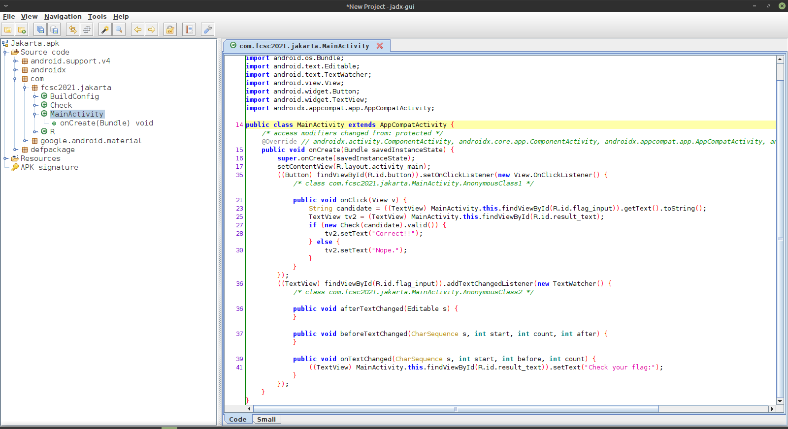

# Jakarta - 25 pts

>  Voici une application Android qui permet de vérifier si le flag est correct.
>
> SHA256(`Jakarta.apk`) = `0691a1401bd10c7c2d8cd196f86f8aa23acf707a98aae480a07ec5e1951a1d04`.
>
> [Jakarta.apk](Jakarta.apk)

Première étape : ouvrir l'apk avec [Jadx GUI](https://github.com/skylot/jadx) pour jeter un œil au code Java.



La classe principale demande un texte et la classe `Check` le vérifie. Voici le contenu de cette classe :

```java
package com.fcsc2021.jakarta;

public class Check {
    int[] enc = {11, 152, 177, 51, 145, 152, 153, 185, 26, 156, 177, 19, 177, 50, 156, 26, 156, 35, 176, 159, 185, 185, 185, 26, 19, 152, 177, 50, 144, 144, 176, 177, 26, 184, 190, 50, 11, 26, 51, 26, 26, 156, 19, 58, 148, 19, 176, 51, 26, 177, 58, 58, 144, 139, 152, 50, 185, 153, 177, 153, 144, 26, 176, 144, 50, 156, 145, 153, 156, 156};
    String flag;

    public Check(String _flag) {
        this.flag = _flag;
    }

    public boolean valid() {
        int len = this.flag.length();
        if (len != this.enc.length) {
            return false;
        }
        int[] A = new int[len];
        for (int i = 0; i < len; i++) {
            int ch = this.flag.charAt(((i * 37) + 1) % len);
            for (int j = 7; j >= 0; j--) {
                A[i] = A[i] ^ (((ch >> j) & 1) << (((j * 5) + 3) % 8));
            }
        }
        int res = 0;
        for (int i2 = 0; i2 < len; i2++) {
            res |= A[i2] ^ this.enc[i2];
        }
        if (res == 0) {
            return true;
        }
        return false;
    }
}
```

Le constructeur transmet le flag à tester et la fonction `valid` le vérifie et renvoie un booléen. Il faut que `res == 0` donc intéressons nous d'abord à ce bloc :

```java
int res = 0;
for (int i2 = 0; i2 < len; i2++) {
    res |= A[i2] ^ this.enc[i2];
}
```

Le `|` c'est un *ou* binaire et le `^` est un *ou exclusif*. Donc res vaut `0` puis à chaque tour de boucle res est égale à *elle-même ou `A[i2] ^ this.enc[i2]`*. Comme on veut que cette valeur reste à zéro, on veut que tous les *ou exclusif* valent zéro. Or par définition `0 ^ 0 = 1` et `1 ^ 1 = 1` donc le *ou exclusif* vaut zéro si les deux données sont identiques. Ce bloc compliqué regarde juste si les deux String `A` et `this.enc` sont identiques ! De plus, on voit au début que le flag transmis doit être de la même taille que le tableau `enc` donc c'est cohérent.

Voyons comment est calculé `A` :

```java
int[] A = new int[len];
for (int i = 0; i < len; i++) {
    int ch = this.flag.charAt(((i * 37) + 1) % len);
    for (int j = 7; j >= 0; j--) {
        A[i] = A[i] ^ (((ch >> j) & 1) << (((j * 5) + 3) % 8));
    }
}
```

Les caractères du flag transmis ne sont pas traités dans l'ordre et on leur applique une transformation étrange. Mais pas besoin de le comprendre puisqu'on sait que le flag est de la forme `FSCSC{`  puis 64 caractères hexadécimaux puis `}`, cela va donc être très facile à bruteforce. Voici un programme Python qui fait le travail :

```python
enc = [11, 152, 177, 51, 145, 152, 153, 185, 26, 156, 177, 19, 177, 50, 156, 26, 156, 35, 176, 159, 185, 185, 185, 26, 19, 152, 177, 50, 144, 144, 176, 177, 26, 184, 190, 50, 11, 26, 51, 26, 26, 156, 19, 58, 148, 19, 176, 51, 26, 177, 58, 58, 144, 139, 152, 50, 185, 153, 177, 153, 144, 26, 176, 144, 50, 156, 145, 153, 156, 156]
flag = list("FCSC{xxxxxxxxxxxxxxxxxxxxxxxxxxxxxxxxxxxxxxxxxxxxxxxxxxxxxxxxxxxxxxxx}")

l = len(flag)
for encIndex in range(l):
    flagIndex = ((encIndex * 37) + 1) % l
    for ch in "0123456789abcdef":
        a = 0
        for j in range(7, -1, -1):
            a = a ^ (((ord(ch) >> j) & 1) << (((j * 5) + 3) % 8))
        if a == enc[encIndex]:
            flag[flagIndex] = ch

print("".join(flag))
```

```
FCSC{6df723aa33b1aa8d604069a693e5990d411a7f7a7169b70e694b0bdf4d26aa9e}
```

