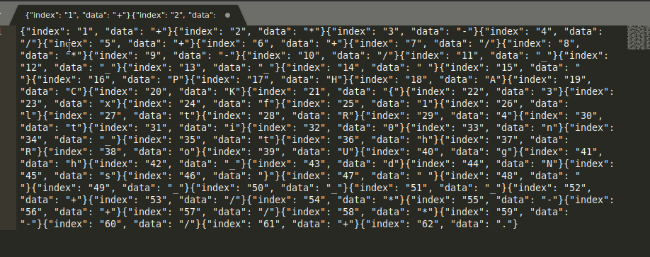

# Thief - 256 pts

> Vous venez de découvrir quelque chose d'étrange en examinant un dump réseau de votre entreprise.
>  Analysez ce fichier et remontez l'alerte si c'est nécessaire. 
>
>  Artiste : `@Eagleslam`
>
> [dump.pcapng](dump2.pcapng)

Je crois que je vous ai déjà dit que le shell était puissant :

```
$ tshark -r dump.pcapng -T fields -e dns.qry.name | grep .phack.fr | uniq | cut -d . -f 1 | xxd -r -ps
{"index": "1", "data": "+"}{"index": "2", "data": "*"}{"index": "3", "data": "-"}{"index": "4", "data": "/"}{"index": "5", "data": "+"}{"index": "6", "data": "+"}{"index": "7", "data": "/"}{"index": "8", "data": "*"}{"index": "9", "data": "-"}{"index": "10", "data": "/"}{"index": "11", "data": "_"}{"index": "12", "data": "_"}{"index": "13", "data": "_"}{"index": "14", "data": " "}{"index": "15", "data": " "}{"index": "16", "data": "P"}{"index": "17", "data": "H"}{"index": "18", "data": "A"}{"index": "19", "data": "C"}{"index": "20", "data": "K"}{"index": "21", "data": "{"}{"index": "22", "data": "3"}{"index": "23", "data": "x"}{"index": "24", "data": "f"}{"index": "25", "data": "1"}{"index": "26", "data": "l"}{"index": "27", "data": "t"}{"index": "28", "data": "R"}{"index": "29", "data": "4"}{"index": "30", "data": "t"}{"index": "31", "data": "i"}{"index": "32", "data": "0"}{"index": "33", "data": "n"}{"index": "34", "data": "_"}{"index": "35", "data": "t"}{"index": "36", "data": "h"}{"index": "37", "data": "R"}{"index": "38", "data": "o"}{"index": "39", "data": "U"}{"index": "40", "data": "g"}{"index": "41", "data": "h"}{"index": "42", "data": "_"}{"index": "43", "data": "d"}{"index": "44", "data": "N"}{"index": "45", "data": "s"}{"index": "46", "data": "}"}{"index": "47", "data": " "}{"index": "48", "data": " "}{"index": "49", "data": "_"}{"index": "50", "data": "_"}{"index": "51", "data": "_"}{"index": "52", "data": "+"}{"index": "53", "data": "/"}{"index": "54", "data": "*"}{"index": "55", "data": "-"}{"index": "56", "data": "+"}{"index": "57", "data": "/"}{"index": "58", "data": "*"}{"index": "59", "data": "-"}{"index": "60", "data": "/"}{"index": "61", "data": "+"}{"index": "62", "data": "."}
```

Alors au lieu de radoter ~~et comme je maîtrise pas bien `sed`~~ je vais aussi vous montrer à quel point Sublime Text est puissant :



Le raccourci clavier magique qui sélectionne toutes les occurrences c'est `ALT+F3` et après il suffit de faire `CTRL+SUPPR` pour supprimer des mots entiers.

