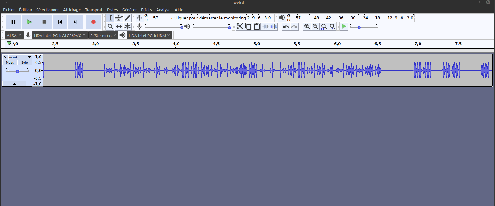

# Aliens - 256 pts

> Enfiiiiin!! Nous avons finalement reçu une  réponse à nos signaux intergalactiques. Un son a été capté et enregistré venant de l'espace. C'est sûr ça doit vouloir dire quelque chose. 
>  
>
>  Artiste : `@Eagleslam`
>
> [weird.wav](./weird.wav)

Le son s'ouvre très bien avec n'importe quel logiciel (enfin un logiciel qui lit les sons hein, pas Paint) et est audible mais ça ressemble en effet à des bruits d'aliens.

Nous allons l'analyser avec [Audacity](https://www.audacityteam.org/). Il suffit simplement d’afficher le spectrogramme (l'amplitude de chaque fréquence dans le temps) :

Encore une fois l'étape la plus compliquée est de recopier le flag sans faute x)