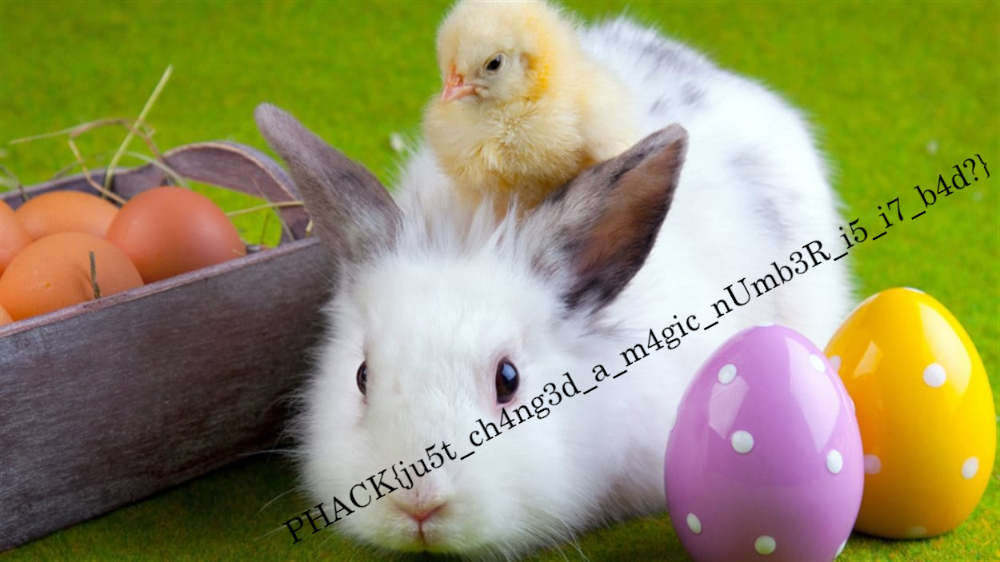

# Alter Egg-o - 256 pts

> L'agent Smith de la HSA (Hack Secret  Agency) a retiré trop rapidement la clé USB de son PC (ce n00b !!). La  preuve qu'il voulait vous montrer semble corrompue. 
>  
>  Montrer lui que vous pouvez lui sauver la mise et récupérer ce fichier. 
>
>  Artiste : `@Eagleslam`
>
> [altered.png](./altered.png)

En essayant d'ouvrir ce fichier avec mon visualiseur d'images j'obtiens le message suivant :

> **Impossible de charger l'image « altered.png ».**
>
> Erreur fatale lors de la lecture du fichier d'image PNG : Not a PNG file

Allons demander son avis à la commande `file` :

```
$ file altered.png
altered.png: data
```

En effet donc le fichier est tellement amoché que l'on ne reconnaît même plus que c'est un PNG. Pour rappel, la plupart des types de fichier ne sont pas définis par l'extension du nom de fichier (le nom c'est juste pour les humains) mais par les premiers octets du fichier appelés *magic number*. Un petit tour sur [la page Wikipédia du format PNG](https://fr.wikipedia.org/wiki/Portable_Network_Graphics) nous indique que ce *magic number* est `89 50 4E 47 0D 0A 1A 0A` (en hexadécimal).

Regardons le début de notre fichier altéré :

```
$ xxd altered.png | head
00000000: dead beef 0d0a 1a0a 0000 000d 4948 4452  ............IHDR
00000010: 0000 04e2 0000 02bf 0806 0000 00c4 4662  ..............Fb
00000020: 5500 001f 947a 5458 7452 6177 2070 726f  U....zTXtRaw pro
00000030: 6669 6c65 2074 7970 6520 6578 6966 0000  file type exif..
00000040: 78da ad9b 6992 2439 72a5 ffe3 143c 0276  x...i.$9r....<.v
00000050: 851e 07ab c8dc 608e cfef 5944 5557 7537  ......`...YDUWu7
00000060: 39a4 c864 4a46 467a b89b c174 798b 0219  9..dJFFz...ty...
00000070: eeff fd3f 2ffc 07bf 2cd9 08b5 d9e8 de7b  ...?/...,......{
00000080: e457 f5ea 79f2 cd88 3fbf fcfb 9a62 fdbe  .W..y...?....b..
00000090: 7ebf 6efe fea5 7fff edf5 b05e ccdf 7799  ~.n........^..w.
```

Les premiers octets (en hexadécimal) sont : `dead beef 0d0a 1a0a`. *Dead beef* est l'une des rares expressions que l'on peut écrire avec les 6 premières lettres de l’alphabet (les seules dispo en hexa) le fichier a clairement été altéré manuellement sur les 4 premiers octets, le reste du *magic number* est valide. Sauvegardons le code hexadécimal dans un fichier texte pour pouvoir l'éditer :

```
$ xxd altered.png > altered.png.hex
```

Il ne vous reste plus qu'à vous munir de votre éditeur de texte préféré pour remplacer `dead beef` par `8950 4e47`. Et ensuite on fait l'opération inverse pour recréer le fichier :

```
$ cat altered.png.hex | xxd -r > altered2.png
```

Et l'image s'affiche, elle n'était presque pas altérée !



Reste l'étape la plus galère : recopier le flag sans faute.