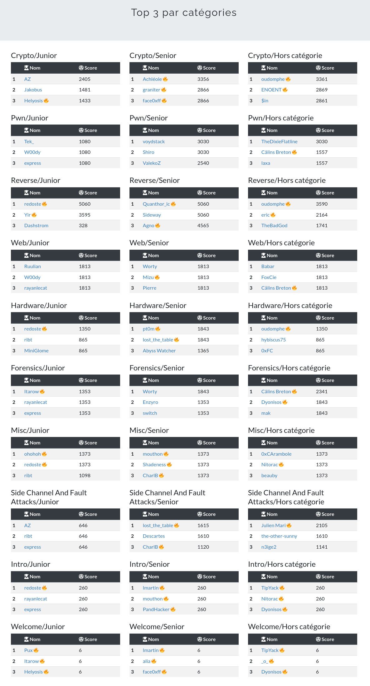

# France CyberSecurity Challenge

Le FCSC est organisé tous les ans par l'ANSSI dans le but de recruter l'équipe qui représentera la France à l'European CyberSecurity Challenge (ECSC) à Viennes en septembre 2022. L'équipe est constituée de 5 juniors (moins de 21 ans) et 5 seniors (21 à 25 ans) auxquels s'ajoutent deux remplaçant pour chaque catégorie.

Je me classe finalement 9e junior (contre 32e l'année dernière !), 2e dans la catégorie hardware, 3e en misc et 2e en Side Channel and Fault Attacks. Ma 2e place en hardware me vaut d'être sélectionné pour les entretiens de recrutement !

Notes : Les challenges sont ici listés approximativement dans l'ordre chronologique où je les ai résolus. Le score est inversement proportionnel au nombres de personnes ayant résolu chaque challenge. 

### hardware

- [I2CyouToo](./hardware/i2c/README.md) - 198 pts
- [Daddy Morse](./hardware/daddy_morse/README.md) - 197 pts
- [Qui est-ce ?](./hardware/qui_est_ce/README.md) - 146 pts
- [Mommy Morse](./hardware/mommy_morse/README.md) - 324 pts

### forensics

- [C3PO](./forensics/c3po/README.md) - 100 pts
- [Échec OP](./forensics/echec_op/README.md) (3 parties) - 20+116+141 = 277 pts
- [À l'ancienne](./forensics/a_lancienne/README.md) (non résolu) - 226 pts

### crypto

- [Shuffled](./crypto/shuffled/README.md) - 100 pts
- [Hashish](./crypto/hashish/README.md) - 336 pts

### misc

- [Guess Me Too](./misc/guessme2/README.md) - 342 pts

### Side Channel and Fault Attacks

- [Never Skip Class Nor Multiplication](./side_channel/nscnm/README.md) - 308 pts
- [Never Skip Class Nor Squaring](./side_channel/nscns/README.md) - 338 pts

Quelques extraits du classement :

Et les challenges que j'ai résolus :

Merci aux orgas pour ce super CTF !!
