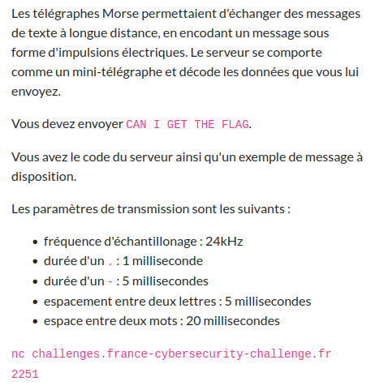
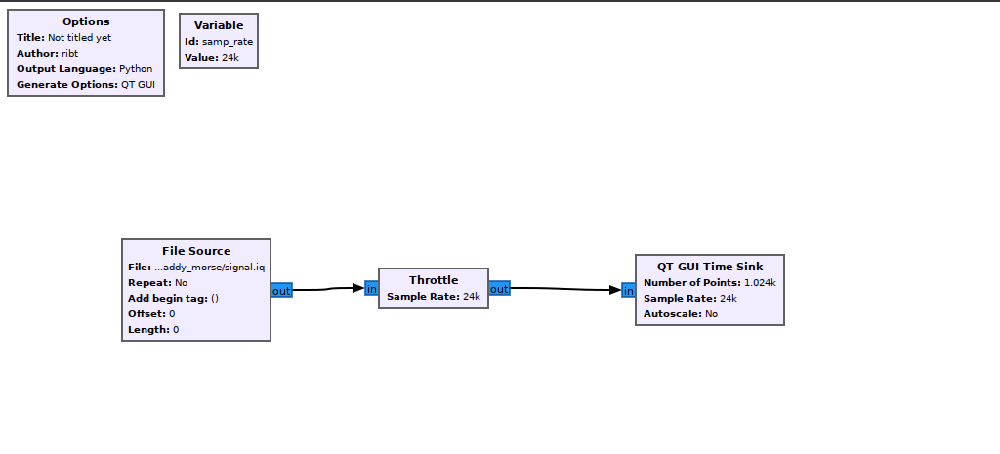
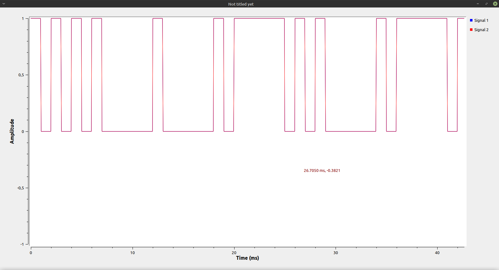
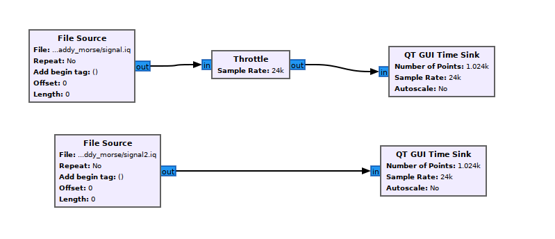
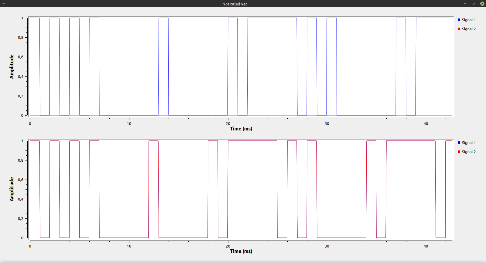

# Daddy Morse

Difficulté : :star:

Énoncé :



Fichiers :

- [client.py](./client.py)
- [server.py](./server.py)
- [signal.iq](./signal.iq)


### Découverte

Ouvrons le fichier `client.py` :

```python
from pwn import *
import numpy as np
import base64

HOST = args.HOST or "challenges.france-cybersecurity-challenge.fr"
PORT = args.PORT or  2251

c = remote(HOST, PORT)

hello_signal = np.fromfile("signal.iq", dtype = np.complex64)

encoded_signal = base64.b64encode(hello_signal.tobytes())

c.recvuntil(b"> ")
c.sendline(encoded_signal)
print(c.recvline())
```

On comprend que le serveur prend un signal IQ encodé en base64.


Maintenant regardons ce qu'il y a dans `signal.iq` avec GNU Radio Companion. Le workflow est très simple :



Le signal l'est tout autant :




Pour rappel, un signal IQ est composé de deux composantes, d'où les "deux signaux" sur le graph. On remarque d'ailleurs que les deux composantes se superposent parfaitement. Le signal vaut soit `1` soit `0` et semble respecter les propriété de l'énoncé.


### Résolution

Ne sachant générer du morse avec GNU Radio Companion, je vais faire cela directement en Python en m'inspirant du code de `client.py` :

```python
from pwn import *
import numpy as np
import base64

SAMP_RATE = 24e3

TIMING_DOT = 1/1000
TIMING_DASH = 5/1000
TIMING_SEP_LETTER = 5/1000
TIMING_SPACE = 20/1000

alphabet = { 'A':'.-', 'B':'-...',
            'C':'-.-.', 'D':'-..', 'E':'.',
            'F':'..-.', 'G':'--.', 'H':'....',
            'I':'..', 'J':'.---', 'K':'-.-',
            'L':'.-..', 'M':'--', 'N':'-.',
            'O':'---', 'P':'.--.', 'Q':'--.-',
            'R':'.-.', 'S':'...', 'T':'-',
            'U':'..-', 'V':'...-', 'W':'.--',
            'X':'-..-', 'Y':'-.--', 'Z':'--..',
            '1':'.----', '2':'..---', '3':'...--',
            '4':'....-', '5':'.....', '6':'-....',
            '7':'--...', '8':'---..', '9':'----.',
            '0':'-----', ', ':'--..--', '.':'.-.-.-',
            '?':'..--..', '/':'-..-.', '-':'-....-',
            '(':'-.--.', ')':'-.--.-'}

HOST = "challenges.france-cybersecurity-challenge.fr"
PORT = 2251
conn = remote(HOST, PORT)

message = "HELLO"
bits = []

for letter in message:
    if letter == " ":
        bits += [0] * int(TIMING_SPACE*SAMP_RATE)
        continue
    for i, c in enumerate(alphabet[letter]):
        if c == ".":
            bits += [1] * int(TIMING_DOT*SAMP_RATE)
        else:
            bits += [1] * int(TIMING_DASH*SAMP_RATE)
        bits += [0] * int(TIMING_DOT*SAMP_RATE)
    bits += [0] * int(TIMING_SEP_LETTER*SAMP_RATE)
    
signal = np.array(bits, dtype=np.complex64).tobytes()

with open("signal2.iq", "wb") as f:
    f.write(signal)

encoded_signal = base64.b64encode(signal)
conn.recvuntil(b"> ")
conn.sendline(encoded_signal)
print(conn.recvline())
```

J'essaie d'encoder `HELLO` et j'envoie cela au serveur pour voir s'il décode ça convenablement, je sauvegarde également mon signal dans un fichier IQ pour pouvoir l'ouvrir avec GNU Radio Companion.

Le serveur répond `Error: invalid`... Le worflow GNU Radio Companion pour comparer donne :






On voit tout d'abord que ma composante complexe vaut toujours `0`... Ensuite, mon espace entre deux lettres est trop long. Je comprends que j'additionne 1 ms plus 5 ms donc je mets 6 ms entre les lettres au lieu de 5 ms. Je corrige cela également pour le délai entre les mots et voici le code final :

```python
from pwn import *
import numpy as np
import base64

SAMP_RATE = 24e3

TIMING_DOT = 1/1000
TIMING_DASH = 5/1000
TIMING_SEP_LETTER = 5/1000
TIMING_SPACE = 20/1000

alphabet = { 'A':'.-', 'B':'-...',
            'C':'-.-.', 'D':'-..', 'E':'.',
            'F':'..-.', 'G':'--.', 'H':'....',
            'I':'..', 'J':'.---', 'K':'-.-',
            'L':'.-..', 'M':'--', 'N':'-.',
            'O':'---', 'P':'.--.', 'Q':'--.-',
            'R':'.-.', 'S':'...', 'T':'-',
            'U':'..-', 'V':'...-', 'W':'.--',
            'X':'-..-', 'Y':'-.--', 'Z':'--..',
            '1':'.----', '2':'..---', '3':'...--',
            '4':'....-', '5':'.....', '6':'-....',
            '7':'--...', '8':'---..', '9':'----.',
            '0':'-----', ', ':'--..--', '.':'.-.-.-',
            '?':'..--..', '/':'-..-.', '-':'-....-',
            '(':'-.--.', ')':'-.--.-'}

HOST = "challenges.france-cybersecurity-challenge.fr"
PORT = 2251
conn = remote(HOST, PORT)

message = "CAN I GET THE FLAG"
bits = []

for letter in message:
    if letter == " ":
        bits += [0] * int((TIMING_SPACE-TIMING_SEP_LETTER)*SAMP_RATE)
        continue
    for i, c in enumerate(alphabet[letter]):
        if c == ".":
            bits += [1+1j] * int(TIMING_DOT*SAMP_RATE)
        else:
            bits += [1+1j] * int(TIMING_DASH*SAMP_RATE)
        if i < len(alphabet[letter])-1:
            bits += [0] * int(TIMING_DOT*SAMP_RATE)
    bits += [0] * int(TIMING_SEP_LETTER*SAMP_RATE)
    
signal = np.array(bits, dtype=np.complex64).tobytes()

with open("signal2.iq", "wb") as f:
    f.write(signal)

encoded_signal = base64.b64encode(signal)
conn.recvuntil(b"> ")
conn.sendline(encoded_signal)
print(conn.recvline())
```


La suite est [ici](../mommy_morse/README.md).
