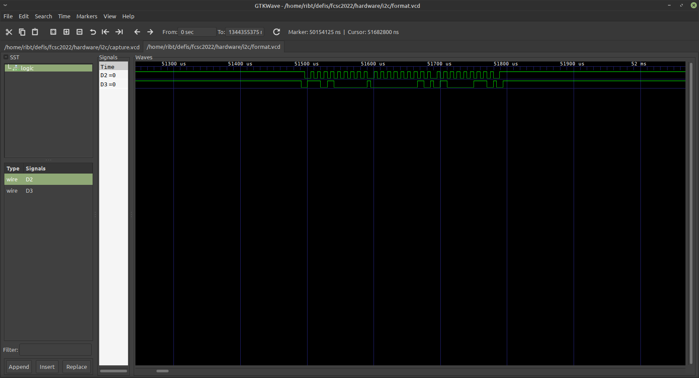

# I2CyouToo

Difficulté : :star:

Énoncé :

> Un ami vous affirme qu'une EEPROM de 1024 bits branchée à son Arduino est une solution extrêmement sécurisée pour stocker ses secrets, vu que le protocole utilisé est "obfusqué" et "bas niveau" selon ses dires, "pas comme l'USB qui est *hotplug* et qu'on peut brancher directement sur n'importe quel OS !". Voulant le confronter à ses inepties, vous sortez votre analyseur logique pour sniffer la communication entre l'Arduino et l'EEPROM lorsqu'il tape son secret. Pourrez-vous remonter à ce dernier avec vos logiciels `Sigrok` et `gtkwave` ?

Fichier : [capture.vcd](./capture.vcd)


### Découverte

Avant de commencer, un peu de lecture sur le sujet (car je n'y connais absolument rien) :

- https://en.wikipedia.org/wiki/Value_change_dump

- http://electroniqueamateur.blogspot.com/2020/01/utiliser-une-memoire-eeprom-i2c-arduino.html

- https://fr.wikipedia.org/wiki/I2C

- https://sigrok.org/wiki/Sigrok-cli

Il semblerait que l'Arduino discute avec la mémoire EEPROM en utilisant le protocole I²C. Ce protocole nécessite deux signaux : l'un contient les données et l'autre sert d'horloge. Ça tombe bien, le fichier VCD comporte l'enregistrement de deux signaux. On ouvre le fichier dans GTKWave pour vérifier :



On voit effectivement un signal d'horloge et des données. On remarque au passage qu'il y a un grand vide au début et à la fin. L'enregistrement est très long par rapport au moment qui contient les données.

### Résolution

En lisant la doc de `sigrok-cli` on voit qu'il sait lire les fichier VCD et qu'il sait décoder le protocole I²C. Premier essai :

```
$ sigrok-cli -i format.vcd -P i2c
sr: input/trace32_ad: Don't know how to handle this file with record size 32.
i2c-1: Start
i2c-1: 0
i2c-1: 0
i2c-1: 0
i2c-1: 0
i2c-1: 1
i2c-1: 0
i2c-1: 1
i2c-1: 1
i2c-1: Write
i2c-1: Address write: 68
i2c-1: ACK
i2c-1: 0
i2c-1: 0
i2c-1: 0
i2c-1: 0
i2c-1: 0
i2c-1: 0
i2c-1: 0
i2c-1: 0
i2c-1: Data write: 00
i2c-1: ACK
i2c-1: 0
i2c-1: 1
i2c-1: 1
i2c-1: 0
i2c-1: 0
i2c-1: 0
i2c-1: 1
i2c-1: 0
i2c-1: Data write: 46
i2c-1: ACK
i2c-1: Stop
i2c-1: Start
i2c-1: 0
i2c-1: 0
i2c-1: 0
i2c-1: 0
i2c-1: 1
i2c-1: 0
i2c-1: 1
i2c-1: 1
i2c-1: Write
i2c-1: Address write: 68
i2c-1: ACK
i2c-1: 1
i2c-1: 0
[...]
```

Ça a l'air de bien fonctionner. L'adresse vaut toujours `68` puis on écrit un chiffre compteur qui incrémente à chaque fois suivi d'un deuxième chiffre qui ressemble bien à un caractère ASCII encodé en hexadécimal.

Reste plus qu'à me la péter un peu avec ma maîtrise du shell :

```
$ sigrok-cli -i format.vcd -P i2c | grep "Data write" | awk 'NR%2 == 0 { print $4 }' | xxd -r -ps
sr: input/trace32_ad: Don't know how to handle this file with record size 32.
FCSC{MY-PRECIOUS-PLEASE-STAY-SECRET!}
```


Merci aux orgas pour ce challenge donné clé en main avec l'occasion d'apprendre de nouvelles choses !