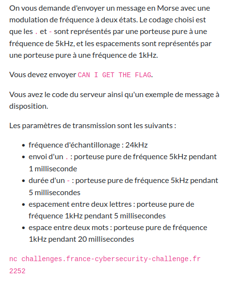
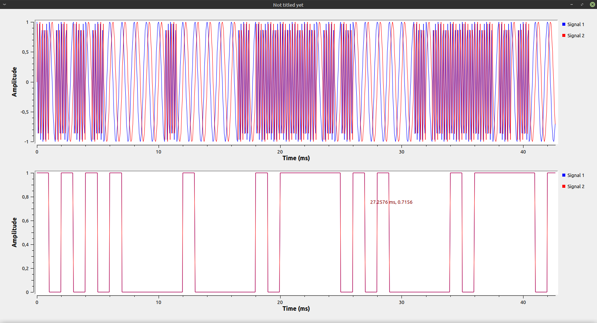
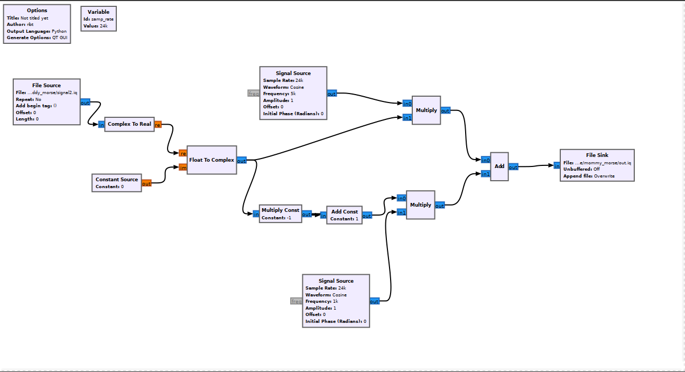

# Mommy Morse

Difficulté : :star::star:

Énoncé :



Fichiers :

- [client.py](./client.py)
- [server.py](./server.py)
- [signal.iq](./signal.iq)


### Découverte

Cela ressemble beaucoup à [Daddy Morse](../daddy_morse/README/md). Mettons côte à côte le `signal.iq` fourni ici avec celui fourni pour Daddy Morse : 




Il "suffit" de reprendre le signal créé pour Daddy Morse et d'envoyer un signal à 5 kHz au lieu de `1` et un signal à 1 kHz au lieu de `0`. 


### Résolution

Voici le workflow GNU Radio Companion qui convertit un fichier IQ Daddy Morse en Mommy Morse :



(Le fichier GRC correspondant est [dispo ici](./workflow.grc).)

Cela peut paraître compliqué mais ça ne l'est pas du tout. Le *File Source* à gauche correspond au signal Daddy Morse. On force la partie imaginaire à zéro pour pouvoir facilement l'utiliser comme multiplicateur. D'un côté on multiplie une porteuse de 5 kHz (*Signal Source* en haut) par ce signal et de l'autre au multiplie une porteuse à 1 kHz (*Signal Source* en bas) par son opposé (multiplier par `-1` puis ajouter `1` pour revient à transformer les `1` du signal en `0` et vice-versa). On somme ces deux signaux et on obtient un joli fichier IQ à envoyer au serveur.

Il suffit donc de reprendre notre fichier IQ [généré précédemment](../daddy_morse/README/md), de le convertir grâce à ce workflow dans GNU Radio Companion et d'envoyer le fichier sortant au serveur grâce au programme `client.py` gentiment fourni dans l'énoncé.

```
Well done: FCSC{490b88345a22d35554b3e319b1200b985cc7683e975969d07841cd56dd488649}
```

