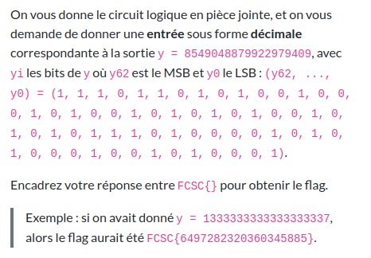
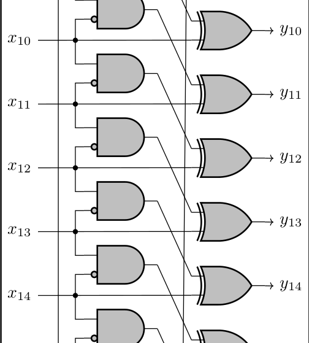

# Qui est-ce ?

Difficulté : :star::star:

Énoncé :



Fichier :

- [circuit.pdf](./circuit.pdf)


### Découverte

Le fichier PDF contient un circuit électronique avec 63 entrées et 63 sorties. Cela paraît beaucoup mais en réalité c'est un pettern qui se répète comme on peut le voir ici :




Toutes les sorties sont définies comme cela :

```
y0 = (x61 & !x62) ^ x0
y1 = (x62 & !x0) ^ x1
y2 = (x0 & !x1) ^ x2
...
y62 = (x60 & !x61) ^ x62
```


### Résolution

Premièrement on essaye de faire un programme qui simule ce circuit. Fort heureusement, on peut tester notre programme grâce à la donnée de l'énoncé `f(6497282320360345885) = 1333333333333333337`. En encodant les bits dans le bon sens, cela donne :

```python
def inv(n):
    if n == 0: return 1
    return 0

def f(n):
    x = [int(i) for i in '{0:063b}'.format(n)][::-1]
    y = [0 for _ in range(63)]

    for i in range(63):
        y[i] = (x[i-2] & inv(x[i-1])) ^ x[i]

    return int("".join(str(b) for b in y[::-1]), 2)
```

Maintenant fait un `for n in range(2**64)` et on attend de trouver une solution qui fonctionne... Mais on se rend rapidement compte qu'il va falloir attend beaucoup trop longtemps.

J'ai essayé de résoudre le problème à la main. Si par exemple on sait que `(x0 & !x1) ^ x2 = 0` et `(x1 & !x2) ^ x3 = 1`, cela signifie que `x2 = !(x0 & !x1)` et `x3 = (x1 & !x2)` mais cela paraît très fastidieux... je dois pouvoir faire calculer cela à mon PC.

Je me souviens avec utiliser un solveur Z3 pour [une précédente édition du FCSC](../../../../2021/FCSC/crypto/rsa-destroyer/README.md) alors je vais essayer de formaliser mon problème dans Z3 et cela me donne un code presque joli qui est trouve la solution en moins d'une seconde !

```python
from z3 import *

x = []
for i in range(63):
    x.append(Bool(f"x{i}"))

y = [bool(int(i)) for i in '{0:063b}'.format(8549048879922979409)][::-1]

s = Solver()

for i in range(63):
    s.add(Xor(And(x[i-2], Not(x[i-1])), x[i]) == y[i])

s.check()
m = s.model()

flag = 0
for i in range(63):
    if m[x[i]]:
        flag += 2**i

print(flag)
```

