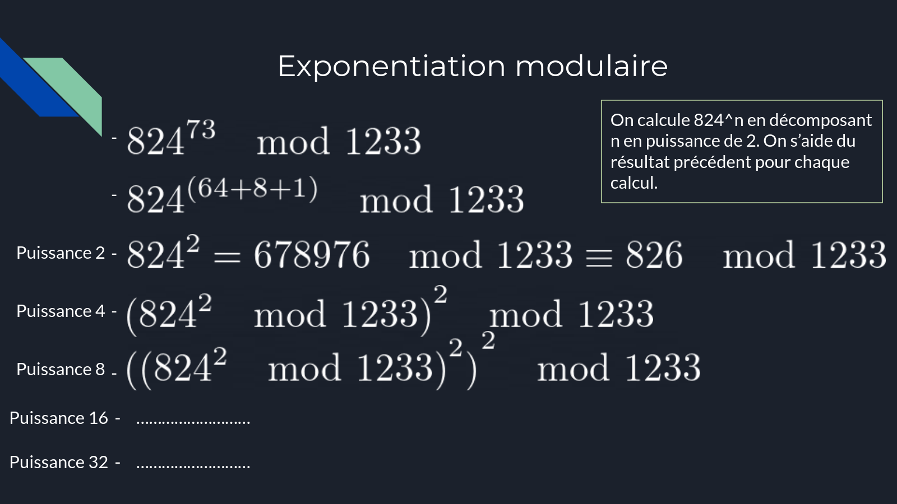
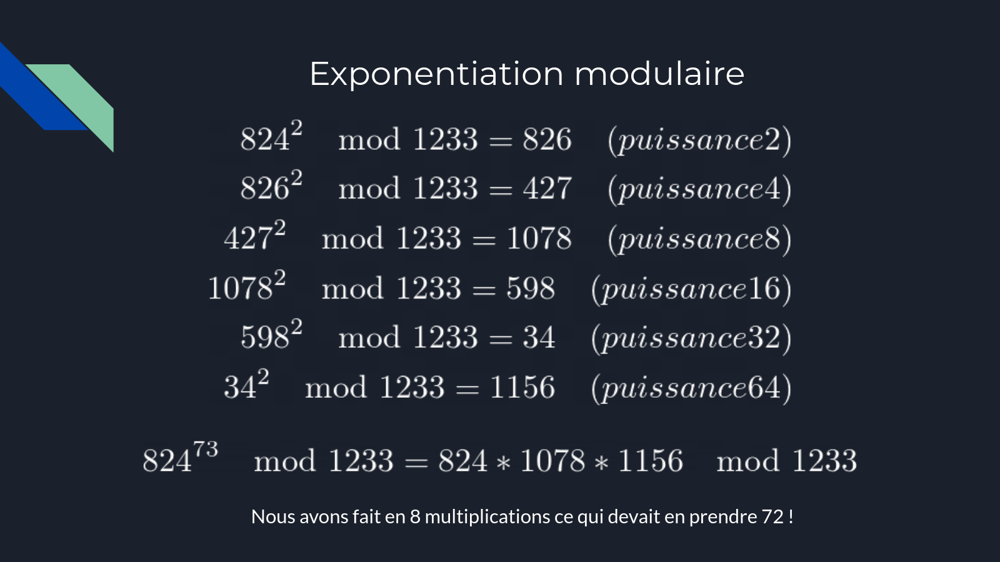

# Never Skip Class Nor Squaring

Difficulté : :star::star:

Énoncé :

> Nous avons accès à un serveur qui permet de signer des messages avec RSA. Lors de la connexion, ce serveur nous transmet un message chiffré que nous voulons déchiffrer.
>
> Le serveur est compromis et il est possible d'injecter des *glitchs* pour sauter les opérations **de mise au carré** dans l'algorithme *square and multiply* utilisé pour réaliser l'exponentiation modulaire du RSA.
>
> Retrouvez la clé de déchiffrement et récupérez le message.
>
> `nc challenges.france-cybersecurity-challenge.fr 2255`

Fichier : [nscns.py](./nscns.py)

### Théorie 

Avant de commencer il faut être au point [le chiffrement RSA](https://fr.wikipedia.org/wiki/Chiffrement_RSA) mais si ça n'est pas le cas, on peut toujours deviner ce fonctionnement grâce au code fourni :

```python
from Crypto.Util.number import getPrime, bytes_to_long

BITS = 256

def exp_mod_skip_squ(x, y, n, skip = -1):
    fmt = f"{{:0{2*BITS}b}}"
    exp = fmt.format(y)

    value = 1
    for i, e in enumerate(exp):
        if skip != i: value *= value
        if e == "1":  value *= x
        value %= n
    return value

if __name__ == "__main__":

    p, q = getPrime(BITS), getPrime(BITS)
    n = p * q
    e = 2 ** 16 + 1
    d = pow(e, -1, (p - 1) * (q - 1))

    print(f"{n = }")
    print(f"{e = }")

    try:
        for _ in range(2 * BITS + 1):
            msg = bytes_to_long(input("msg = ").encode())
            if msg == 0:
                break
            skip = int(input("skip = "))
            print(exp_mod_skip_squ(msg, d, n, skip))
    except:
        print("Please check your inputs.")
        exit(0)

    with open("flag.txt", "rb") as fp:
        m = bytes_to_long(fp.read().strip())
        assert m < n
        c = pow(m, e, n)
        print(f"{c = }")

```

La clé privée (`n`) nous est fournie et nous pouvons proposer 513 messages qui seront signés avec la clé privée (`d`). De plus, ce service nous propose de sauter une des étapes de l'exponentiation modulaire (explication à suivre).

La clé privée fait 512 bits et on a le droit de poser 513 questions au serveur, cela rappelle [un challenge misc](https://github.com/ribt/writeups/blob/master/2022/FCSC/misc/guessme2/README.md)... Il va falloir retrouver tous les bits de la clé privée uns par uns.

Dans le chiffrement RSA on a toujours besoin de mettre un nombre *exposant* un autre *modulo* un troisième. Tous ces nombres étant gigantesques (ordre de grandeur : $$ 2^{512} $$) on a du inventer un moyen de faire cette opération beaucoup plus efficace que la méthode naïve : c'est [l'exponentiation modulaire](https://fr.wikipedia.org/wiki/Exponentiation_modulaire). Il se trouve que par hasard j'ai eu l'occasion de faire un oral sur le sujet cette année alors voici quelques slides pour aider à comprendre le principe :






Le comportement de l'exponentiation modulaire est décrit par cette fonction :

```python
def exp_mod_skip_squ(x, y, n, skip = -1):
    fmt = f"{{:0{2*BITS}b}}"
    exp = fmt.format(y)

    value = 1
    for i, e in enumerate(exp):
        if skip != i: value *= value
        if e == "1":  value *= x
        value %= n
    return value
```

Si on ignore la ligne contenant le *skip* le comportement est le suivant pour mettre `x` à la puissance `y` modulo `n` :

- Mettre `value` à `1`
- Pour chaque bit de l'exposant en binaire :
  - Élever `value` au carré
  - Si le bit est à `1`, multiplier `value` par x
  - Appliquer le modulo `n` à `value`

Cela fait exactement la même chose que ce qui est présenté sur les slides.

Pour s'en convaincre, appliquons l'algorithme avec $$ y = 42 = (00101010)_{2} $$  (notez que j'ai encodé 42 sur 8 bits et non 512)

|  i   |  e   |               value                |
| :--: | :--: | :--------------------------------: |
|  0   |  0   |              $$ 1 $$               |
|  1   |  0   |              $$ 1 $$               |
|  2   |  1   |              $$ x $$               |
|  3   |  0   |             $$ x^2 $$              |
|  4   |  1   |         $$ x^4 \times x $$         |
|  5   |  0   |       $$ x^{8} \times x^2 $$       |
|  6   |  1   |  $$ x^{16} \times x^4 \times x $$  |
|  7   |  0   | $$ x^{32} \times x^8 \times x^2 $$ |

On récupère bien $$ x^{32} \times x^8 \times x^2 = x^{32+8+2} = x^{42} $$.


Le challenge ici c'est qu'une *faille* nous permet de passer l'étape *Élever `value` au carré* pour le bit de rang `skip`. Refaisons le tableau avec `skip = 3` :

|    i     |  e   |               value                |
| :------: | :--: | :--------------------------------: |
|    0     |  0   |              $$ 1 $$               |
|    1     |  0   |              $$ 1 $$               |
|    2     |  1   |              $$ x $$               |
| 3 (skip) |  0   |              $$ x $$               |
|    4     |  1   |         $$ x^2 \times x $$         |
|    5     |  0   |       $$ x^{4} \times x^2 $$       |
|    6     |  1   |  $$ x^{8} \times x^4 \times x $$   |
|    7     |  0   | $$ x^{16} \times x^8 \times x^2 $$ |

On voit bien que l'erreur se propage à toute les étapes jusqu'à récupérer en bout de chaîne $$ x^{16} \times x^8 \times x^2 = x^{26} $$ car l'exposant $$ 32$$ a été divisé par deux.


Deuxième exemple en skippant l'étape 4 :

|    i     |  e   |               value                |
| :------: | :--: | :--------------------------------: |
|    0     |  0   |              $$ 1 $$               |
|    1     |  0   |              $$ 1 $$               |
|    2     |  1   |              $$ x $$               |
|    3     |  0   |             $$ x^2 $$              |
| 4 (skip) |  1   |         $$ x^2 \times x $$         |
|    5     |  0   |       $$ x^{4} \times x^2 $$       |
|    6     |  1   |  $$ x^{8} \times x^4 \times x $$   |
|    7     |  0   | $$ x^{16} \times x^8 \times x^2 $$ |

Cela revient au même que skipper l'étape 3. Pourquoi ? Car il n'y a pas eu de $$ \times x $$ à l'étape 3.


Dernier exemple pour comprendre :

|    i     |  e   |               value                |
| :------: | :--: | :--------------------------------: |
|    0     |  0   |              $$ 1 $$               |
|    1     |  0   |              $$ 1 $$               |
|    2     |  1   |              $$ x $$               |
|    3     |  0   |             $$ x^2 $$              |
|    4     |  1   |         $$ x^4 \times x $$         |
| 5 (skip) |  0   |        $$ x^{4} \times x $$        |
|    6     |  1   |  $$ x^{8} \times x^2 \times x $$   |
|    7     |  0   | $$ x^{16} \times x^4 \times x^2 $$ |

Le résultat est différent de la fois précédente car il y a eu une multiplication par x lors de l'étape précédente.


### Résolution

On sent bien que le meilleur moyen de trouver la clé privée est d'envoyer un message constant en donnant toutes les valeurs possible à `skip`.

Pour rappel ce que nous voulons trouver c'est les bits de `d` donc ceux qui disent de *multiplier `value` par x* dans la boucle d’exponentiation modulaire.

La stratégie est la suivant :

- Choisir un message fixe : 42
- Demander la vraie signature de ce message (`skip = 0` c'est-à-dire éviter de mettre 1 au carré au début) 
- Demander la signature de ce message avec `skip = 1`.
  - Si la réponse diffère de la précédente alors il y a eu un $$ \times x $$ lors de l'étape 0 parce que oublier de mettre 1 au carré n'aurait pas d'impact sur le résultat final. Cela signifie que le bit 0 est un 1.
  - Si la réponse ne diffère pas alors il y n'a pas eu de $$ \times x $$ lors de l'étape 0, c'est-à-dire que le bit 0 de `d` est un 0.
- Demander la signature de ce message avec `skip = 2`.
  - Si la réponse diffère de la précédente alors il y a eu un $$ \times x $$ lors de l'étape 1, cela signifie que le bit 1 est un 1.
  - Si la réponse ne diffère pas alors il y n'a pas eu de $$ \times x $$ lors de l'étape 1, c'est-à-dire que le bit 1 de `d` est un 0.
- ...


Et voici le code final qui applique cette méthode :

```python
from pwn import remote

BITS = 256

conn = remote("challenges.france-cybersecurity-challenge.fr", 2255)

n = int(conn.recvline().decode().strip()[4:])
e = int(conn.recvline().decode().strip()[4:])

conn.recvuntil("= ")

msg = 42
conn.send(str(msg)+"\n")
conn.recvuntil("= ")
conn.send("0\n")

ref = int(conn.recvline().decode().strip())
ans = ""

for i in range(1, 2 * BITS + 1):
    conn.recvuntil("= ")
    conn.send(str(msg)+"\n")
    conn.recvuntil("= ")
    conn.send(str(i)+"\n")
    t = int(conn.recvline().decode().strip())
    if t != ref:
        ans +="1"
    else:
        ans += "0"
    ref = t
    print(ans)

d = int(ans, 2)
c = int(conn.recvline().decode().strip()[4:])

conn.close()

m = pow(c, d, n)

print(bytes.fromhex(hex(m)[2:]).decode())
```

flag : `FCSC{4f26ff30464a6bbeaefcfdddce92a18cb0836a236d2706aac8c81d99de}`
