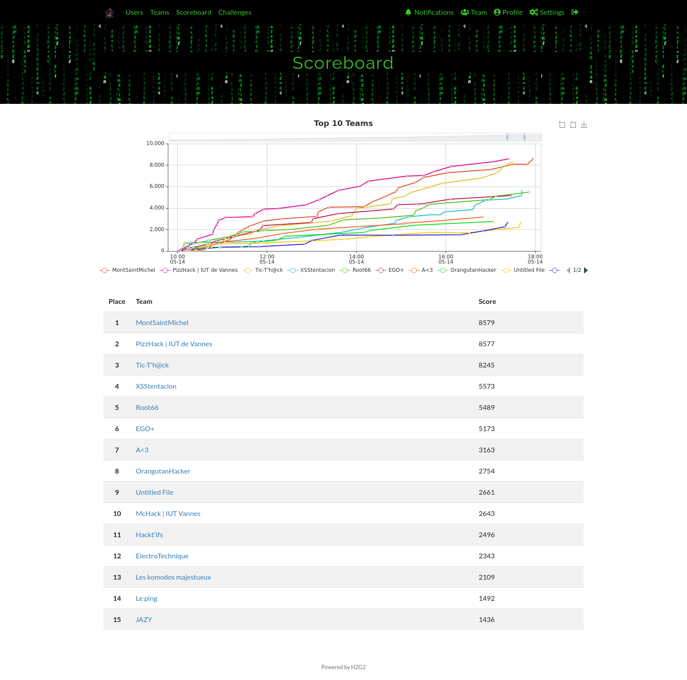
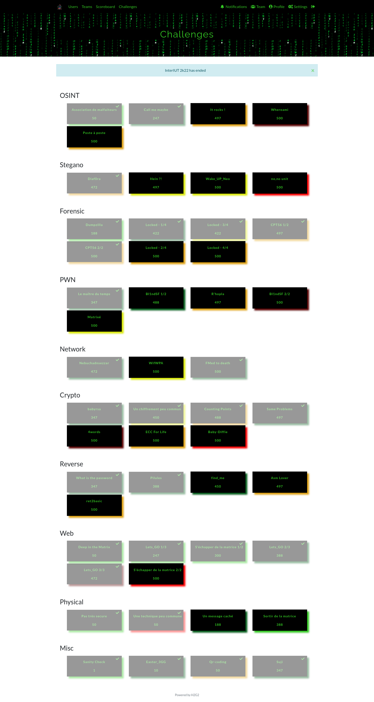

# CTF InterIUT 2022

[TOC]

## Présentation

Le CTF InterIUT est un CTF organisé tous les ans par les étudiants de l'ENSIBS. Il est ouvert aux étudiants de niveau bac+1 et bac+2.

J'ai participé aux deux éditions précédentes (avec la team MontSaintMichel) qui avaient lieu en distanciel et cette année l'évènement a lieu en présentiel, à Vannes. 15 équipes de 4 étudiants participent et notre équipe de l'IUT de Caen a remporté la 1ère place ! Les circonstances de la victoire sont assez rocambolesques et détaillées dans [le write-up de CPT56](./forensics/README.md).

Scoreboard final :

Et voici la liste des challenges résolus par mon équipe :

## Les write-ups !

Voici les write-ups de quelques challenges avec peu de solves. N'hésitez pas à me demander si vous voulez que j'en ajoute d'autres. 

### Forensic

- [CPT-56](./forensics/README.md) (2 parties) - 997 pts
