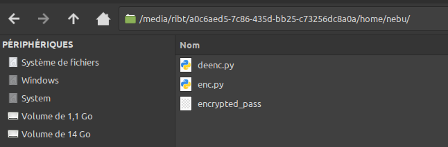
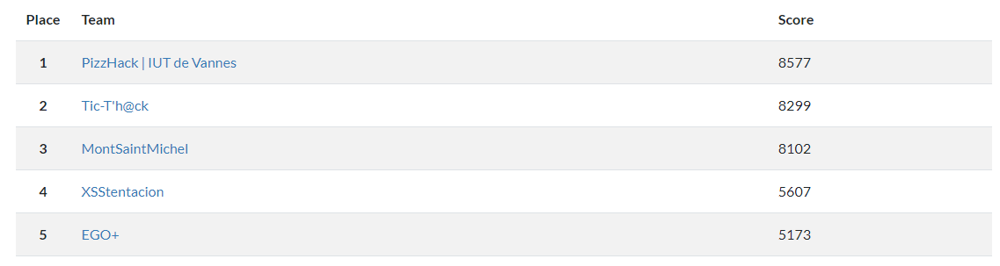
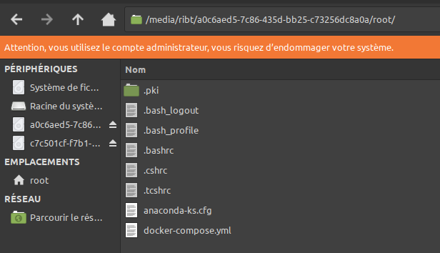
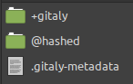
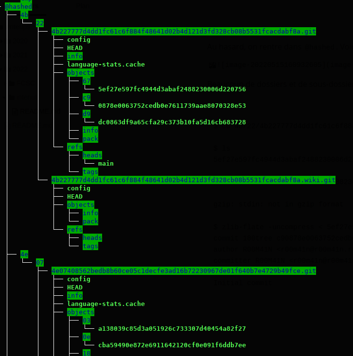
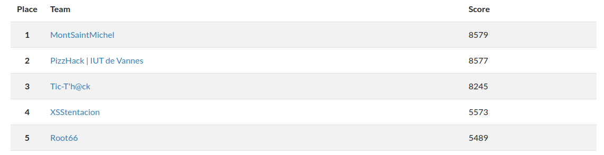

# CTF InterIUT 2022

## Write Up – CPT 56

auteur : ribt

team : MontSaintMichel

catégorie : forensic


### Partie 1/2

Solves : 2

Énoncé :

> Un Serveur utilisé par le Service de Threat Intel à été corrompu alors qu'ils enquêtaient sur le groupe CTP56 connu pour péter tous ceux qui souhaitent enquêter sur eux. On a réussi à récuperer le serveur ainsi que l'iso avec lequel il fut  installé. De plus l'utilisateur nebu nous as donné son couple  user:password (nebu:nebu) il a besoin de récuperer un fichier dans  /home/nebu
>
> Fichier volumineux 7,5GO
>
> Pass de l'archive = `c06e361dbccf2f57b40e18cffb16a980bd6f4b239905d6e1f637f001e2ed7507`
>
> Sha256 = `18645b898839bb94935a685a396b806afd079a7a94a623d800c90d4c2c3d3c87`

Hint :

> Il se peut qu'une partie du File System ait disparue. Regardé ce que l'iso peut vous apporter

Fichier : [CPT56.zip](https://filesender.renater.fr/?s=download&token=5fbd8ac9-1132-467c-abe8-62e371d2a2f3)


Le forensics étant une des catégories que j'affectionne tout particulièrement, je commence ce challenge dès le début du CTF. Deux fichiers à l'intérieur de l'archive fournie :

- CentOS-7-x86_64-DVD-2009.iso
- Nebu_prod.ova

Pour le premier fichier, on le retrouve [sur un miroir de CentOS](https://mirror.umd.edu/centos/7/isos/x86_64/). Le sha256 est identique donc j'en déduis que je n'en tirerai pas d'informations intéressantes de ce fichier.

Le 2e fichier est une machine virtuelle VirtualBox. Je double clique sur le fichier pour l'importer, je laisse toutes les options par défaut, ça charge quelques minutes... Et j'obtiens cette erreur :

 ```
 Échec de l'importation de l'appareil virtuel Nebu_prod.ova.
 
 Code d'erreur : NS_ERROR_INVALID_ARG (0x80070057)
 ```

Je réessaye en 2e fois, j'essaie de changer les options mais rien y fait. C'est probablement dû au fait qu'il reste 6 Go de libre sur le disque de mon PC... Plutôt que de faire du tri, je passe à un autre challenge.


Plus tard dans la journée LighTender m'informe que la VM s'installe très bien sur son PC, confirmant l'hypothèse du manque de place sur mon disque. Grub lui propose trois options pour booter. Chacun demande un `localhost login` et `password` et les creds de l'énoncé ne passent pas. Encore une fois, nous prenons la décision de passer à autre chose plus facile.


À 30 minutes de la fin, notre team passe 3e sur le scoreboard (alors que nous somme restés 2e toute la journée). La tension monte et nous comprenons qu'il va falloir être stratégique pour gagner des points. Je parcours les challenges et je vois que `CPT 56 1/2` n'a toujours pas été solve. Ce challenge rapporte donc 500 points et permets d'accéder à une 2e partie pour l'instant inaccessible. Je prends donc la décision de me focus sur ce challenge pendant que les autres gars tryhard l'OSINT.

Je commence par supprimer le dump mémoire du challenge `Locked` pour libérer 10 Go sur mon disque. Désormais la VM s'importe bien sur ma machine mais j'ai le même problème que LighTender : impossible de me connecter. Je relis l'énoncé : il faut "récuperer un fichier dans  /home/nebu". Je me dis qu'il doit bien exister un moyen de monter un disque virtuel. Je tombe alors sur [ce post](https://askubuntu.com/questions/19430/mount-a-virtualbox-drive-image-vdi). Le challenge se termine dans moins d'une heure donc je copie les commandes sans réfléchir :

```
sudo rmmod nbd
sudo modprobe nbd max_part=16
sudo qemu-nbd -c "/dev/nbd0 /home/ribt/VirtualBox VMs/Nebu_prod/Nebu_prod-disk001.vdi"
```

La première commande me renvoie l'erreur `rmmod: ERROR: Module nbd is not currently loaded`, laissant assez peu d'espoir. Cependant les deux commandes suivantes fonctionnent et deux disques apparaissent dans mon explorateur de fichier !

Le contenu de /home/nebu :



Petit coup de frayeur en pensant arriver sur un crypto mais en réalité le code de déchiffrement est donné.

```
$ python2 deenc.py 
interiut{rm-rf/usr/bin_1s_t0_d4nger0us}
```

Et boum, first blood à 17h32 !


Cependant nous sommes toujours 3e lorsque, à 17h40, le scoreboard est freeze pour conserver un peu de suspens :



La pression est palpable dans notre équipe. Il va falloir tout donner sur le challenge qui vient de se débloquer.


### Partie 2/2

Solves : 1

Énoncé :

> Il semblerait qu'un membre de CPT56 ait  réussi à avoir accès au gitlab et ait supprimé le projet lié à  l'activité du groupe, es-tu capable de retrouver les informations  supprimées ? (root:Interiut2k22Linux)
>
> (Même fichier que pour CPT56 1/2)

On voit assez rapidement des infos dans /root :



On notera l'explorateur ouvert en tant que root sur ma machine : on veut des résultats vite et on va essayer de pas casser mon PC...

Le `docker-compose.yml` :

```
version: '3'

services:
  bluex-gitlab:
    image: gitlab/gitlab-ce:14.9.2-ce.0
    restart: always
    volumes:
      - /data/gitlab/config:/etc/gitlab:Z
      - /data/gitlab/data:/var/opt/gitlab:Z
      - /data/gitlab/logs:/var/log/gitlab:Z
    ports:
      - '80:80'
```

Coïncidence : Esteban a suivi une formation docker la veille ! Sous son expertise je lance donc un shell dans le dossier pour faire un `docker-compose up`. Ensuite je devrais pouvoir me connecter à http://localhost pour accéder au GitLab... mais ça ne fonctionne pas. J'essaye de le mettre sur un autre port que 80 mais toujours aucun résultat. Il reste une quinzaine de minutes donc il va falloir trouver autre chose.

Tous les gars de la team se renseignent sur le fonctionnement de GitLab, comment retrouver un projet suprimé... On apprend que les données des projets git sont dans `/var/opt/gitlab/git-data/repositories/`. Cela cofrrespond au dossier `/data/gitlab/data/git-data/repositories/` de la VM d'après le docker-compose . On vérifie quand même rapidement si on ne trouve pas un flag dans `/data/gitlab/config` ou `/data/gitlab/logs` mais, à première vue, rien d'intéressant dans ces deux dossiers.

Le contenu de `/data/gitlab/data/git-data/repositories/` :



Au hasard, on rentre dans `@hashed`. Voici un extrait de sa structure :



Beaucoup de dossiers et de sous-dossiers... Allons voir le premier :

```
$ cd 4b/22/4b227777d4dd1fc61c6f884f48641d02b4d121d3fd328cb08b5531fcacdabf8a.git/objects/67/

$ ls
5ef27e597fc4944d3abaf2488230006d220756

$ file 5ef27e597fc4944d3abaf2488230006d220756 
5ef27e597fc4944d3abaf2488230006d220756: zlib compressed data

$ cat 5ef27e597fc4944d3abaf2488230006d220756 | gzip -dc
gzip: stdin: not in gzip format

$ cat 5ef27e597fc4944d3abaf2488230006d220756 | zlib-flate -uncompress
commit 180tree c90878e0063752cedb0e7611739aae8070328e53
author R00M41N <r00m41n@r00m41n.r00m41n> 1649268532 +0000
committer R00M41N <r00m41n@r00m41n.r00m41n> 1649268532 +0000

Initial commit
```


On arrive à sortir les données de git mais il va falloir trouver un script ou écrire rapidement une commande bash pour lire tous les fichiers de tous les dossiers... en moins d'un quart d'heure !

Je remontre dans tous les dossiers parents en essayant de faire la commande `git status`... sans succès.

Tout à coup je remarque que le dossier s'appelle `4b227777d4dd1fc61c6f884f48641d02b4d121d3fd328cb08b5531fcacdabf8a.git` et qu'il a la structure d'un `.git` donc il suffit de le renommer !

 ```
 $ mv 4b227777d4dd1fc61c6f884f48641d02b4d121d3fd328cb08b5531fcacdabf8a.git .git
 
 $ git status 
 fatal: unsafe repository ('/media/ribt/a0c6aed5-7c86-435d-bb25-c73256dc8a0a/data/gitlab/data/git-data/repositories/@hashed/4b/22' is owned by someone else)
 To add an exception for this directory, call:
 
 	git config --global --add safe.directory /media/ribt/a0c6aed5-7c86-435d-bb25-c73256dc8a0a/data/gitlab/data/git-data/repositories/@hashed/4b/22
 
 $ git config --global --add safe.directory /media/ribt/a0c6aed5-7c86-435d-bb25-c73256dc8a0a/data/gitlab/data/git-data/repositories/@hashed/4b/22
 
 $ git status 
 fatal: Cette opération doit être effectuée dans un arbre de travail
 
 $ git log -p
 commit 675ef27e597fc4944d3abaf2488230006d220756 (HEAD -> main)
 Author: R00M41N <r00m41n@r00m41n.r00m41n>
 Date:   Wed Apr 6 18:08:52 2022 +0000
 
     Initial commit
 
 diff --git a/README.md b/README.md
 new file mode 100644
 index 0000000..d9dc086
 --- /dev/null
 +++ b/README.md
 @@ -0,0 +1,92 @@
 +# BeepBeep
 +
 +
 +
 +## Getting started
 +
 +To make it easy for you to get started with GitLab, here's a list of recommended next steps.
 +
 +Already a pro? Just edit this README.md and make it your own. Want to make it easy? [Use the template at the bottom](#editing-this-readme)!
 +
 +## Add your files
 [...]
 ```

Bingo ! On affiche toutes les logs d'un repo !

Sauf qu'il reste quelques minutes que qu'on a un certain nombre de fichiers au format `xxx.git`. Il va donc falloir trouver le bon et très vite ! En reprenant la sortie de `tree @hashed` (dont le screen au dessus est issu) on remarque un dossier avec plus d'objets que les autres qui s'appelle `ef2d127de37b942baad06145e54b0c619a1f22327b2ebbcfbec78f5564afe39d+5+deleted.git` ! On applique la même technique que vu précédemment :

```
$ cd ef/2d/

$ mv ef2d127de37b942baad06145e54b0c619a1f22327b2ebbcfbec78f5564afe39d+5+deleted.git/ .git

$ git config --global --add safe.directory /media/ribt/a0c6aed5-7c86-435d-bb25-c73256dc8a0a/data/gitlab/data/git-data/repositories/@hashed/ef/2d

$ git log -p
commit 3b199c21dae94e4277775ae7ae377c1aa923e73e (HEAD -> main)
Author: Threat Intel Service <tis@tis.tis>
Date:   Wed Apr 6 18:23:30 2022 +0000

    Verif INFOS

diff --git a/README.md b/README.md
index 6b60793..106e170 100644
--- a/README.md
+++ b/README.md
@@ -12,3 +12,5 @@ YVc1MFpYSnBkWFI3UkROc00xUkhNVlJmVkRCZlNERkVNMTlPTkUwelUzMD0gZGVjb2RlIGVuY29yZSB1
 
 
 XOR : Crypto-HAckeur
+
+OK!
[...]
```

On dirait bien qu'on a le flag !

```
$ echo YVc1MFpYSnBkWFI3UkROc00xUkhNVlJmVkRCZlNERkVNMTlPTkUwelUzMD0gZGVjb2RlIGVuY29yZSB1bmUgZm9pcw== | base64 -d
aW50ZXJpdXR7RDNsM1RHMVRfVDBfSDFEM19ONE0zU30= decode encore une fois
```

Quelle bande de petits rigolos... Vous savez qu'il reste moins de 5 minutes avant la fin du CTF ?

```
$ echo aW50ZXJpdXR7RDNsM1RHMVRfVDBfSDFEM19ONE0zU30= | base64 -d
interiut{D3l3TG1T_T0_H1D3_N4M3S}
```

Cette fois c'est la bonne :)


Et nous apprendrons à l'annonce des résultats que nous avons gratté la première place, 2 points devant PizzHack !!




Merci Folcoxx pour ce challenge bien sympa et à toute l'orga pour ce super CTF !