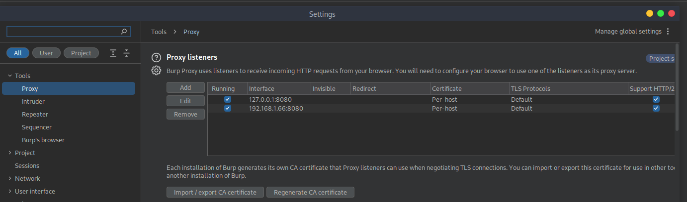
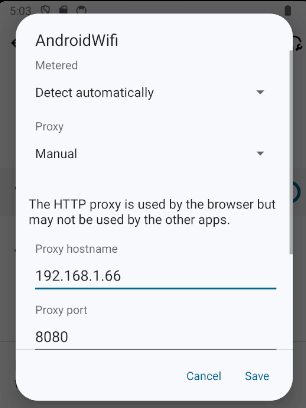
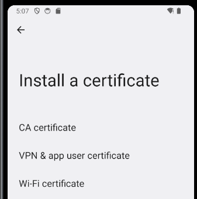
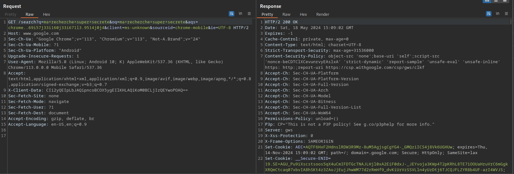
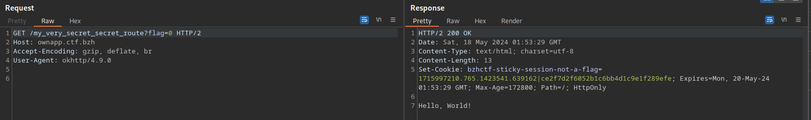

## Contexte

Fichier fourni : [ownapp.apk](./ownapp.apk)

Objectif : contourner les protections empêchant d'intercepter le trafic réseau.

## Analyse statique

Dans un premier temps on décompile l'APK avec [jadx](https://github.com/skylot/jadx).

```java
public class MainActivity extends AppCompatActivity {
    private ActivityMainBinding binding;

    public native String getURL();

    static {
        System.loadLibrary("ownapp");
    }

    /* JADX INFO: Access modifiers changed from: protected */
    @Override // androidx.fragment.app.FragmentActivity, androidx.activity.ComponentActivity, androidx.core.app.ComponentActivity, android.app.Activity
    public void onCreate(Bundle savedInstanceState) {
        super.onCreate(savedInstanceState);
        ActivityMainBinding inflate = ActivityMainBinding.inflate(getLayoutInflater());
        this.binding = inflate;
        setContentView(inflate.getRoot());
        TextView tv = this.binding.sampleText;
        HttpClient httpClient = new HttpClient();
        httpClient.execute("https://" + getURL());
        tv.setText("[DEBUG] Request sent !");
    }
}

public class HttpClient extends AsyncTask<String, Void, String> {
    private static final String TAG = "HttpRequestTask";

    /* JADX INFO: Access modifiers changed from: protected */
    @Override // android.os.AsyncTask
    public String doInBackground(String... params) {
        String urlString = params[0];
        try {
            OkHttpClient client = new OkHttpClient.Builder().certificatePinner(new CertificatePinner.Builder().add("ownapp.ctf.bzh", "sha256/jdUcBmV4SClWUpavrOctB6mBKVB3CBIC4R0qxkD5RFo=").build()).build();
            Request request = new Request.Builder().url(urlString).build();
            Response response = client.newCall(request).execute();
            if (response.isSuccessful()) {
                return response.body().string();
            }
            Log.e(TAG, "[DEBUG] Erreur lors de la requête HTTP: " + response.code());
            return null;
        } catch (Exception e) {
            Log.e(TAG, "[DEBUG - CRITICAL] Erreur lors de la requête HTTP");
            Log.e(TAG, Log.getStackTraceString(e));
            return null;
        }
    }

    /* JADX INFO: Access modifiers changed from: protected */
    @Override // android.os.AsyncTask
    public void onPostExecute(String result) {
        if (result == null) {
            Log.e(TAG, "[DEBUG] La requête a échoué");
            return;
        }
        Log.d(TAG, "[DEBUG] Réponse du serveur : " + result);
    }
}
```

On voit une vérification de type SSL pinning ("épinglage de certificat") sur `ownapp.ctf.bzh` avec l'empreinte `sha256/jdUcBmV4SClWUpavrOctB6mBKVB3CBIC4R0qxkD5RFo=`. On ne peut pas facilement savoir quelle URL est accédée par `httpClient.execute("https://" + getURL());` car la méthode `getURL` n'est pas définie ici dans le code Java mais dans la librairie compilée `ownapp`. On peut extraire `libownapp.so` mais ce dernier est obfusqué et complexe à comprendre. Et le but de ce challenge est de faire de l'analyse réseau.

## Analyse dynamique

On va lancer l'application dans l'émulateur par défaut d'Android Studio. L'outil adb permet d'installer l'APK :

```
adb install ownapp.apk
```

On lance un proxy [Burp Suite](https://portswigger.net/burp/communitydownload) pour capturer le trafic. On fera attention à bien activer le proxy sur une interface autre que localhost pour y accéder depuis l'émulateur Android.



Dans les paramètres Wi-Fi de l'émulateur on précise d'utiliser le proxy :



On peut désormais ouvrir `http://burpsuite/cert` dans le navigateur de l'émulateur pour récupérer le certificat de Burp. On peut ensuite aller dans les paramètres pour l'ajouter comme autorité de confiance :



En consultant un site HTTPS dans le navigateur de l'émulateur on voit bien le trafic en clair dans Burp Suite :



Mais naturellement si on lance l'appli OwnApp et qu'on regarde les logs, on obtient un refus comme le code de laissait supposé :

```
$ adb logcat | grep -F "`adb shell ps | grep com.example.ownapp | tr -s [:space:] ' ' | cut -d' ' -f2`"
[...]
05-18 17:16:28.515  5293  5322 E HttpRequestTask: [DEBUG - CRITICAL] Erreur lors de la requête HTTP
05-18 17:16:28.517  5293  5322 E HttpRequestTask: javax.net.ssl.SSLPeerUnverifiedException: Certificate pinning failure!
05-18 17:16:28.517  5293  5322 E HttpRequestTask:   Peer certificate chain:
05-18 17:16:28.517  5293  5322 E HttpRequestTask:     sha256/V1GsCJooV/5h/W8Dsh7N+dnlpAlx1KfSgSEaPD60pSY=: CN=ownapp.ctf.bzh,OU=PortSwigger CA,O=PortSwigger,C=PortSwigger
05-18 17:16:28.517  5293  5322 E HttpRequestTask:     sha256/V1GsCJooV/5h/W8Dsh7N+dnlpAlx1KfSgSEaPD60pSY=: CN=PortSwigger CA,OU=PortSwigger CA,O=PortSwigger,L=PortSwigger,ST=PortSwigger,C=PortSwigger
05-18 17:16:28.517  5293  5322 E HttpRequestTask:   Pinned certificates for ownapp.ctf.bzh:
05-18 17:16:28.517  5293  5322 E HttpRequestTask:     sha256/jdUcBmV4SClWUpavrOctB6mBKVB3CBIC4R0qxkD5RFo=
05-18 17:16:28.517  5293  5322 E HttpRequestTask: 	at okhttp3.CertificatePinner.check$okhttp(CertificatePinner.kt:200)
05-18 17:16:28.517  5293  5322 E HttpRequestTask: 	at okhttp3.internal.connection.RealConnection.connectTls(RealConnection.kt:410)
05-18 17:16:28.517  5293  5322 E HttpRequestTask: 	at okhttp3.internal.connection.RealConnection.establishProtocol(RealConnection.kt:337)
05-18 17:16:28.517  5293  5322 E HttpRequestTask: 	at okhttp3.internal.connection.RealConnection.connect(RealConnection.kt:209)
05-18 17:16:28.517  5293  5322 E HttpRequestTask: 	at okhttp3.internal.connection.ExchangeFinder.findConnection(ExchangeFinder.kt:226)
05-18 17:16:28.517  5293  5322 E HttpRequestTask: 	at okhttp3.internal.connection.ExchangeFinder.findHealthyConnection(ExchangeFinder.kt:106)
05-18 17:16:28.517  5293  5322 E HttpRequestTask: 	at okhttp3.internal.connection.ExchangeFinder.find(ExchangeFinder.kt:74)
05-18 17:16:28.517  5293  5322 E HttpRequestTask: 	at okhttp3.internal.connection.RealCall.initExchange$okhttp(RealCall.kt:255)
05-18 17:16:28.517  5293  5322 E HttpRequestTask: 	at okhttp3.internal.connection.ConnectInterceptor.intercept(ConnectInterceptor.kt:32)
05-18 17:16:28.517  5293  5322 E HttpRequestTask: 	at okhttp3.internal.http.RealInterceptorChain.proceed(RealInterceptorChain.kt:109)
05-18 17:16:28.517  5293  5322 E HttpRequestTask: 	at okhttp3.internal.cache.CacheInterceptor.intercept(CacheInterceptor.kt:95)
05-18 17:16:28.517  5293  5322 E HttpRequestTask: 	at okhttp3.internal.http.RealInterceptorChain.proceed(RealInterceptorChain.kt:109)
05-18 17:16:28.517  5293  5322 E HttpRequestTask: 	at okhttp3.internal.http.BridgeInterceptor.intercept(BridgeInterceptor.kt:83)
05-18 17:16:28.517  5293  5322 E HttpRequestTask: 	at okhttp3.internal.http.RealInterceptorChain.proceed(RealInterceptorChain.kt:109)
05-18 17:16:28.517  5293  5322 E HttpRequestTask: 	at okhttp3.internal.http.RetryAndFollowUpInterceptor.intercept(RetryAndFollowUpInterceptor.kt:76)
05-18 17:16:28.517  5293  5322 E HttpRequestTask: 	at okhttp3.internal.http.RealInterceptorChain.proceed(RealInterceptorChain.kt:109)
05-18 17:16:28.517  5293  5322 E HttpRequestTask: 	at okhttp3.internal.connection.RealCall.getResponseWithInterceptorChain$okhttp(RealCall.kt:201)
05-18 17:16:28.517  5293  5322 E HttpRequestTask: 	at okhttp3.internal.connection.RealCall.execute(RealCall.kt:154)
05-18 17:16:28.517  5293  5322 E HttpRequestTask: 	at com.example.ownapp.HttpClient.doInBackground(HttpClient.java:28)
05-18 17:16:28.517  5293  5322 E HttpRequestTask: 	at com.example.ownapp.HttpClient.doInBackground(HttpClient.java:10)
05-18 17:16:28.517  5293  5322 E HttpRequestTask: 	at android.os.AsyncTask$3.call(AsyncTask.java:394)
05-18 17:16:28.517  5293  5322 E HttpRequestTask: 	at java.util.concurrent.FutureTask.run(FutureTask.java:264)
05-18 17:16:28.517  5293  5322 E HttpRequestTask: 	at android.os.AsyncTask$SerialExecutor$1.run(AsyncTask.java:305)
05-18 17:16:28.517  5293  5322 E HttpRequestTask: 	at java.util.concurrent.ThreadPoolExecutor.runWorker(ThreadPoolExecutor.java:1145)
05-18 17:16:28.517  5293  5322 E HttpRequestTask: 	at java.util.concurrent.ThreadPoolExecutor$Worker.run(ThreadPoolExecutor.java:644)
05-18 17:16:28.517  5293  5322 E HttpRequestTask: 	at java.lang.Thread.run(Thread.java:1012)
05-18 17:16:28.517  5293  5293 E HttpRequestTask: [DEBUG] La requête a échoué
```

## Patch de l'application

La solution que j'ai identifiée comme la moins risquée est de patcher l'application en modifiant seulement le string avec le hash du certificat pour maximiser les chances de recompiler l'appli avec succès.


Tout d'abord on va essayer de trouver comment calculer ce hash. Après quelques essais avec des résultats trouvés sur Internet, l'un d'eux s'avère concluant :

```
$ openssl s_client -servername ownapp.ctf.bzh -connect ownapp.ctf.bzh:443 |
   openssl x509 -pubkey -noout |
   openssl ec -pubin -outform der |
   openssl dgst -sha256 -binary |
   openssl enc -base64
[...]
jdUcBmV4SClWUpavrOctB6mBKVB3CBIC4R0qxkD5RFo=
```

Une simple option permet d'avoir la nouvelle empreinte en passant par le proxy :

```
$ openssl s_client -proxy localhost:8080 -servername ownapp.ctf.bzh -connect ownapp.ctf.bzh:443 |
   openssl x509 -pubkey -noout |
   openssl ec -pubin -outform der |
   openssl dgst -sha256 -binary |
   openssl enc -base64
[...]
V1GsCJooV/5h/W8Dsh7N+dnlpAlx1KfSgSEaPD60pSY=
```

(Je me rends compte en écrivant ce WU que l'on pouvait directement récupérer la valeur de la 2e empreinte dans la traceback d'erreur affichée avec logcat.)

On décompile l'APK avec `apktool d -r ownapp.apk -o src/`, le flag `-r` permettant de ne pas décompiler les ressources et ainsi maximiser les chances que la recompilation se passe bien.

On remplace l'ancienne signature par la nouvelle dans `src/smali_classes3/com/example/ownapp/HttpClient.smali`.

On recompile : `apktool b -r src/ -o ownapp_patched.apk`.

En essayant d'installer ce nouvel APK, après l'avoir signé, j'obtenais l'erreur `INSTALL_FAILED_INVALID_APK: Failed to extract native libraries`. La commande suivante permet de fixer cela : `zipalign -p -f 4 ownapp_patched.apk ownapp_patched_aligned.apk`.

L'erreur `INSTALL_PARSE_FAILED_NO_CERTIFICATES: Failed to collect certificates` indique qu'il faut signer l'APK. Pour cela on doit d'abord générer un certificat :

```
$ keytool -genkey -v -keystore my-release-key.keystore -alias alias_name -keyalg RSA -keysize 2048 -validity 10000
Entrez le mot de passe du fichier de clés :  123456
Ressaisissez le nouveau mot de passe : 123456
Quels sont vos nom et prénom ?
  [Unknown]:  
Quel est le nom de votre unité organisationnelle ?
  [Unknown]:  
Quel est le nom de votre entreprise ?
  [Unknown]:  
Quel est le nom de votre ville de résidence ?
  [Unknown]:  
Quel est le nom de votre état ou province ?
  [Unknown]:  
Quel est le code pays à deux lettres pour cette unité ?
  [Unknown]:  
Est-ce CN=Unknown, OU=Unknown, O=Unknown, L=Unknown, ST=Unknown, C=Unknown ?
  [non]:  oui

Génération d'une paire de clés RSA de 2 048 bits et d'un certificat auto-signé (SHA256withRSA) d'une validité de 10 000 jours
	pour : CN=Unknown, OU=Unknown, O=Unknown, L=Unknown, ST=Unknown, C=Unknown
[Stockage de my-release-key.keystore]
```

On pourra désormais utiliser ce keystore pour signer tous nos APK :

```
$ ~/Android/Sdk/build-tools/34.0.0/apksigner sign -ks my-release-key.keystore ownapp_patched_aligned.apk 
Keystore password for signer #1: 123456
```

Enfin, on supprime l'ancienne appli pour installer la nouvelle :

```
$ adb uninstall com.example.ownapp
Success

$ adb install ownapp_patched_aligned.apk
Performing Incremental Install
Serving...
All files should be loaded. Notifying the device.
Success
Install command complete in 112 ms
```

La nouvelle appli se lance sans poser de problème et on voit passer le trafic en clair !



Mais pas de flag en vue... Après clarification auprès du chall-maker, le paramètre `flag=0` indique au serveur de renvoyer `Hello, World!` et `flag=1` permet de récupérer le flag. On envoie donc cette requête dans le module Repeater de Burp, on modifie ce paramètre et le serveur nous répond bien avec le flag !

