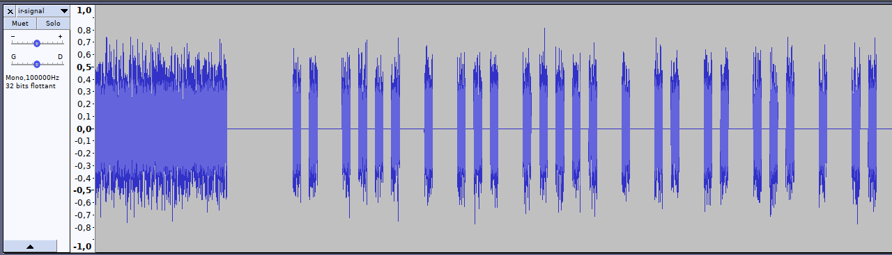

# NECessIR - 44 pts - 76 solves

Voici l'énoncé :


Commençons par faire des recherches sur les télécommandes infra-rouges. On tombe rapidement sur [ce site](https://www.electroschematics.com/ir-decoder-encoder-part-1/). L'explication est très claire : la LED IR s'allume 9 ms (c'est le *burst*) pour dire qu'elle va commencer puis fait une pause de 4,5 ms avant l'envoi des données bit par bit. Le bit est défini par la distance temporelle entre deux pulsions. Une distance de 1,125 ms correspond a un `0` et une distance de 2,25 ms sorrespond à un `1`.

Essayons donc d'ouvrir le fichier. On ouvre Audacity et dans le menu `Fichier` on choisit `Importer` puis `Données brutes (Raw)`. Ensuite on sélectionne notre fichier. Pour choisir les bonnes options il faut regarder la commande `arecord`. Un petit `man arecord` nous indique que `-r192000` signifie que le taux d'échantillonage est de 192 000 Hz, `-c1` signifie que le son est mono (un seul canal) et `S16_BE` désigne des entiers signés 16 bits encodés en [big-endian](https://fr.wikipedia.org/wiki/Boutisme).

On obtient alors un signal composé de 4 *blocs*. En zoomant sur le début du premier bloc, on voit qu'il commence bien par un *burst* puis est constitué de pics espacés par une distance non constante.



Exportons le fichier en `.wav` pour l'analyser en Python.

```Python
import scipy.io.wavfile

_, data = scipy.io.wavfile.read('ir-signal.wav')
rate = 192 # f/ms
```

Le tableau `data` contient des entiers allant de -30000 à 30000 environ. Commençons par mesurer la durée du burst. Le principe consiste à faire une moyenne glissante des valeurs absolues de 5 entiers puis de voir si cette moyenne est supérieure à 100 pour savoir si on a un signal ou non.

```Python
offset = 0
moy = 1000
while moy > 100:
    moy = 0
    for i in range(5) : moy += abs(data[offset+i])
    moy /= 5
    offset += 5
    
print("burst de", offset/rate, "ms")
```
Ce qui donne `burst de 8.958333333333334 ms`. Cela correspond aux 9 ms du site.

Faisons une boucle qui affiche le temps entre chaque signal.

```Python
offset = 0
while True :
    print ()
    delta = 0
    moy = 1000
    while moy > 100:
        moy = 0
        for i in range(5) : moy += abs(data[offset+delta+i])
        moy /= 5
        delta += 5
        
    print("pic de", round(delta/rate, 1), "ms")

    offset += delta

    delta = 0
    moy = 0
    while moy < 100:
        moy = 0
        for i in range(5) : moy += abs(data[offset+delta+i])
        moy /= 5
        delta += 5
        
    print("pause de", round(delta/rate, 1), "ms")

    offset += delta
```

On obtient :
```
pic de 9.0 ms
pause de 4.4 ms

pic de 0.6 ms
pause de 0.5 ms

pic de 0.6 ms
pause de 1.7 ms

pic de 0.6 ms
pause de 0.5 ms

pic de 0.6 ms
pause de 0.5 ms

pic de 0.6 ms
pause de 0.5 ms

pic de 0.6 ms
pause de 1.7 ms

pic de 0.6 ms
pause de 1.6 ms
``` 
et ainsi de suite...

Après le burst, la longueur des pics est constante mais la pause varie de 0,5 ms à 1,7 ms. Cela diffère de ce qu'on attendait mais on nous dit bien que la télécommande a été modifiée.

Ne reste plus qu'à créer une variable qui va contenir les bits selon le temps de pause et qui va analyser les quatres blocs. Le programme final est disponible ici : [decode-signal.py](./decode-signal.py). Et il affiche bien le flag !
